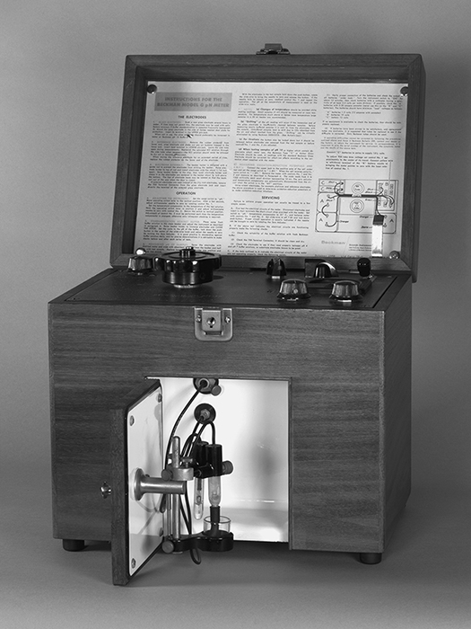

# Capítulo 1 · La química en la historia

## La química como empeño humano

Goethe describió la química como la ciencia que interroga a la Naturaleza con los instrumentos del experimentador [@brock2015, cap. 1]. Esa imagen resume la esencia de una disciplina que practican hoy cerca de tres millones de personas y que ha identificado más de setenta millones de sustancias [@brock2015, cap. 1]. La palabra *chemist* no existió, sin embargo, hasta 1834, cuando William Whewell la propuso por analogía con *artist* [@brock2015, cap. 1].

La invención del término selló el paso del artesano anónimo del fuego al investigador sistemático de la [**materia**]{#sec-materia}. Al mismo tiempo, la química ocupó su lugar central entre las ciencias naturales, posición que le reconoce el propio título de la obra de Brown [@brown2012, cap. 1; @brock2015, cap. 1]. La [**balanza**]{#sec-balanza} fue el instrumento que consumó esta transformación, pues convirtió la especulación sobre los materiales en una aritmética de masas verificable [@atkins2015, cap. 1; @brock2015, cap. 1].

La historia de la química es entonces la historia de cómo se aprendió a identificar sustancias, medir sus transformaciones y explicarlas con modelos que se predicen y corrigen [@brown2012, cap. 1; @brock2015, cap. 1]. Antes de los laboratorios modernos, el conocimiento químico se acumuló en talleres, boticas y cocinas. Después se organizó en leyes ponderales, tablas periódicas y teorías atómicas, y finalmente se expandió hacia instrumentos electrónicos y síntesis planificada [@brock2015, cap. 1; @atkins2015, cap. 1].

## La química artesanal {#sec-quimica-artesanal}

Las primeras sustancias identificadas aparecen en excavaciones de Egipto, Persia y Mesopotamia desde el quinto milenio antes de nuestra era [@brock2015, cap. 2]. El [**natrón**]{#sec-natron}, sal común impura extraída de lagos secos o de la evaporación del agua del Nilo, se usó en embalsamamiento y conservación de alimentos [@brock2015, cap. 2]. Las recetas de perfumes apenas han cambiado en milenios: su ingrediente básico ha sido siempre el [**glicerol**]{#sec-glicerol}, un alcohol azucarado viscoso [@brock2015, cap. 2].

Plinio, en su *Historia Natural* del siglo primero, registró la tecnología romana que explotaba el alga *Dunaliella salina*, capaz de crecer en el ambiente hostil de las salinas. Los romanos la llamaban [**flos salis**]{#sec-flos-salis}, flor de sal, y de sus células rojas extraían glicerol y betacaroteno, el precursor de la vitamina A [@brock2015, cap. 2]. Ambos productos siguen extrayéndose hoy de la misma alga como base de perfumes coloreados [@brock2015, cap. 2].

El dominio del fuego fue la precondición de estos logros, pues sin él no habría habido alfarería, vidrio ni extracción de metales. Hogares arqueológicos datados en 230.000 años muestran que varias especies de homínidos aprendieron a crear, controlar y propagar el fuego [@brock2015, cap. 2]. Hacia el año 8000 antes de nuestra era, la fermentación de granos ya producía pan, cerveza y vino [@brock2015, cap. 2].

El control del fuego y la temperatura dio paso a las primeras tecnologías químicas: la [**alfarería**]{#sec-alfareria} a partir de arcillas cocidas, los [**metales**]{#sec-metales}, el [**vidrio**]{#sec-vidrio}, el [**betún**]{#sec-betun} y el [**yeso**]{#sec-yeso} [@brock2015, cap. 2]. El asfalto mesopotámico, mezcla de alquitrán natural con caliza, arena y grava, servía como sellador en viviendas y barcos. El yeso de caliza permitía fabricar grandes bloques de construcción [@brock2015, cap. 2].

## La teoría atómica y las leyes ponderales

La química cuantitativa nació cuando la balanza acompañó a los análisis cualitativos y planteó la pregunta por las proporciones. En 1792, [**Benjamin Richter**]{#sec-richter} demostró que al neutralizar ácidos con bases se requerían cantidades determinadas de ácido para cada peso fijo de base; ese peso fijo o [**equivalente**]{#sec-equivalente} definía la reacción [@brock2015, cap. 9]. La ley de [**proporciones fijas**]{#sec-ley-proporciones-fijas}, defendida por Joseph Proust frente a la idea de proporciones variables de Berthollet, estableció que los elementos se combinan en razones constantes por masa [@brock2015, cap. 9; @brown2012, sec. 2.1].

Sobre ese andamiaje empírico, John Dalton construyó su [**teoría atómica**]{#sec-teoria-atomica-dalton}: la materia es particulada, cada elemento tiene átomos de masa característica y los compuestos se forman combinando átomos en proporciones fijas [@brown2012, sec. 2.1; @pauling1988, cap. 2; @brock2015, cap. 9]. La teoría explicaba la ley de composición constante, la [**ley de conservación de la masa**]{#sec-ley-conservacion-masa} y la [**ley de las proporciones múltiples**]{#sec-ley-proporciones-multiples}: si dos elementos forman más de un compuesto, las masas de uno que se combinan con una masa fija del otro están en razón de números enteros pequeños [@brown2012, sec. 2.1; @pauling1988, cap. 2; @brock2015, cap. 9].

{#fig-dalton-simbolos}

*Nota.* Figura reproducida de [@brock2015, il. 9], © Oxford University Press (2015), reutilizada con fines educativos de estudio propio. Cortesía: Roy G. Neville Collection, Othmer Library of Chemical History, Chemical Heritage Foundation.

Dalton llegó a la teoría partiendo de la meteorología al preguntarse por qué la atmósfera, formada por varios gases, no se estratifica por peso [@brock2015, cap. 9]. La figura @fig-dalton-simbolos reproduce los símbolos con que representó los elementos conocidos en su *New System of Chemical Philosophy* [@brock2015, fig. 9].

Su respuesta apeló a partículas de cada gas que se repelen entre sí pero no interactúan entre especies, la [**ley de las presiones parciales de Dalton**]{#sec-ley-presiones-parciales} [@brock2015, cap. 9; @pauling1988, cap. 9]. Para explicar por qué los gases se disuelven de modo distinto en agua, concluyó que los átomos de elementos distintos tienen tamaños diferentes, y el cálculo de esos tamaños requirió pesos atómicos [@brock2015, cap. 9; @brown2012, sec. 2.1].

Alrededor de 1804, el cálculo de pesos atómicos relativos se convirtió en una base cuantitativa nueva para toda la química, publicada primero por Thomas Thomson en 1807 y luego por Dalton en 1808 [@brock2015, cap. 9]. Los problemas metodológicos de su sistema no se resolvieron hasta Cannizzaro en los años cincuenta del siglo XIX, y la estructura del átomo real esperó a Rutherford y Soddy en el siglo veinte [@brock2015, cap. 9; @brown2012, sec. 2.1; @pauling1988, cap. 2].

## La diversificación: química orgánica e inorgánica

La revolución química del siglo XVIII reorganizó la disciplina en torno a problemas de clasificación. Antoine Fourcroy, discípulo de Lavoisier, fue el primero en demostrar que la variedad de compuestos extraídos de plantas y animales contiene solo unos pocos elementos: carbono, hidrógeno, oxígeno y nitrógeno, y ocasionalmente azufre y fósforo [@brock2015, cap. 11; @brown2012, cap. 24].

Fourcroy dividió la química en los dos grandes dominios de [**inorgánica y orgánica**]{#sec-quimica-organica-inorganica}; este último término designó hasta la década de 1830 las sustancias extraídas de los seres vivos [@brock2015, cap. 11]. Como los químicos prepararon tantos derivados que no existían en el mundo vivo, el término adquirió un sentido más amplio. Solo en 1858 Friedrich Kekulé definió la [**química orgánica como la química de los compuestos de carbono**]{#sec-definicion-quimica-organica} [@brock2015, cap. 11; @brown2012, cap. 24; @pauling1988, cap. 23].

Los químicos del siglo XIX imaginaron átomos y construyeron modelos atómicos y moleculares que ayudaron a crear una disciplina académica e industrialmente significativa. La «química de papel» y los mundos moleculares imaginados sirvieron a sus estudios y a su progreso [@brock2015, cap. 11]. Estos modelos serían la puerta de entrada a la química estructural del siglo siguiente [@brock2015, cap. 11; @pauling1988, cap. 6].

## La periodicidad: Mendeleev

El orden llegó a la química inorgánica por una vía paralela a la que la teoría de valencia dio a la orgánica [@brock2015, cap. 14]. En el primer congreso internacional de químicos, celebrado en Karlsruhe en 1860, Cannizzaro recomendó adoptar la hipótesis de Avogadro: volúmenes iguales de gases a la misma temperatura y presión contienen el mismo número de moléculas [@brock2015, cap. 14; @pauling1988, cap. 5]. Solo con esa regla fue posible una lista acordada de [**pesos atómicos**]{#sec-pesos-atomicos}, y con ella pudo trabajar Mendeleev [@brock2015, cap. 14; @brown2012, cap. 7].

Dmitri Mendeleev buscaba una forma de estructurar un libro de texto en 1869 cuando dio con la [**ley periódica**]{#sec-ley-periodica-mendeleev}: los elementos ordenados según el valor de sus pesos atómicos muestran una alteración escalonada de sus propiedades, de modo que los elementos químicamente análogos, como los metales alcalinos o los halógenos, caen en grupos naturales [@brock2015, cap. 14; @brown2012, cap. 7; @pauling1988, cap. 5].

Los químicos prestaron poca atención a la tabla hasta que las predicciones de Mendeleev sobre elementos desconocidos se confirmaron: el galio en 1875 y el escandio en 1879 [@brock2015, cap. 14; @brown2012, cap. 7]. La tabla periódica resume relaciones entre los elementos que permiten inferir propiedades de unas decenas de sustancias a partir de su posición [@atkins2015, cap. 2; @brown2012, cap. 7].

Oxígeno y azufre resultaron primos vecinos; nitrógeno y fósforo también; cobre, plata y oro quedaron en la misma familia [@atkins2015, cap. 2; @brown2012, cap. 7]. Sus apariencias tan distintas resultaron diferencias superficiales frente a profundas semejanzas químicas, que se comprendieron plenamente cuando se explicó la estructura electrónica de los átomos [@atkins2015, cap. 2; @brown2012, cap. 6; @pauling1988, cap. 5].

## Termodinámica: energía, entropía y entalpía

La termodinámica química comenzó con la [**termoquímica**]{#sec-termoquimica-historica} del siglo XVIII. Joseph Black mostró que distintas sustancias tienen [**calores específicos**]{#sec-calores-especificos} diferentes y que fundir un sólido o hervir un líquido requiere grandes cantidades de calor que no registra el termómetro, los llamados [**calores latentes**]{#sec-calores-latentes} de fusión y de vaporización [@brock2015, cap. 17; @brown2012, cap. 5].

Pierre Dulong y Alexis Petit encontraron en esos calores una relación empírica útil: el peso atómico de un elemento multiplicado por su calor específico es igual a 6,4, lo que sirvió para determinar pesos atómicos, como demostró Berzelius [@brock2015, cap. 17; @brown2012, cap. 5]. En los años 1840, Rudolf Clausius estableció la [**primera ley de la termodinámica**]{#sec-primera-ley-termodinamica}: cuando se realiza trabajo mediante calor, se consume una cantidad de calor proporcional al trabajo hecho, y el gasto equivalente de trabajo produce una cantidad igual de calor [@brock2015, cap. 17; @atkins2015, cap. 3; @brown2012, cap. 19].

Clausius entendió el calor como movimiento mecánico de partículas y percibió el cambio químico como disociación en la que el calor separa las moléculas venciendo sus afinidades [@brock2015, cap. 17]. Entre 1838 y 1840, Germain Hess mostró que el calor liberado en una reacción, más tarde llamado [**entalpía**]{#sec-entalpia-historica}, es constante tanto si la reacción ocurre en un solo paso como en varios; esta es la [**ley de Hess**]{#sec-ley-hess}, consecuencia directa de la conservación de la energía [@brock2015, cap. 17; @brown2012, cap. 5; @atkins2015, cap. 3].

Los químicos tardaron en adoptar la segunda ley porque no comprendían la [**entropía**]{#sec-entropia-boltzmann}; incluso la obra de Gibbs, con sus setecientas ecuaciones sobre el equilibrio, pareció incomprensible a Clerk Maxwell [@brock2015, cap. 17; @atkins2015, cap. 3]. La idea de Boltzmann de describir el movimiento de las partículas de un gas por promedios estadísticos permitió interpretar la entropía como desorden: cuanto mayor es la entropía, mayor es el desorden molecular, y la entropía es la fuerza impulsora de las reacciones químicas [@brock2015, cap. 17; @atkins2015, cap. 3; @brown2012, cap. 19].

Solo en 1923, el libro *Thermodynamics* de Gilbert N. Lewis y Merle Randall estableció una notación consistente y popularizó la **energía libre**, el máximo de trabajo extraíble de un proceso químico [@brock2015, cap. 17; @atkins2015, cap. 3; @brown2012, cap. 19]. En 1909, Kamerlingh Onnes sugirió llamar **entalpía** («calor dentro», del griego) a la porción de energía producida entre puntos de temperatura acordados; el término se difundió desde los años cincuenta [@brock2015, cap. 17; @brown2012, cap. 5].

Desde los años sesenta, la termodinámica se resume en las «tres e», simbolizadas por G (energía libre, por Gibbs), S (entropía, probablemente por Sadi Carnot) y H (entalpía, por la ley de Hess) [@brock2015, cap. 17; @brown2012, cap. 19]. Esta notación sigue vigente en los tratados actuales y la retomaremos en los capítulos dedicados a la termoquímica y la termodinámica química [@brock2015, cap. 17; @brown2012, cap. 19].

## La revolución instrumental {#sec-revolucion-instrumental}

El creador de herramientas más influyente del siglo veinte fue Arnold Beckman, quien en 1934 patentó el [**pH-metro**]{#sec-ph-metro} portátil que calculaba la acidez electrónicamente [@brock2015, cap. 18; @brown2012, cap. 16]. La escala logarítmica de pH había sido introducida en 1909 por el bioquímico danés Søren Sørensen; el pH significaba «potencial de iones hidrógeno», con cero para la acidez extrema y catorce para la basicidad extrema [@brock2015, cap. 18; @brown2012, cap. 16].

Medir el pH exigía análisis volumétricos complicados fuera de sitio hasta que Beckman, al abandonar la academia, fundó una compañía que fabricó pH-metros y espectrofotómetros de absorción para la industria alimentaria [@brock2015, cap. 18]. La [**espectroscopia infrarroja**]{#sec-espectroscopia-infrarroja} había comenzado a fines del siglo XIX, cuando dos ex oficiales del ejército británico correlacionaron espectros infrarrojos con grupos funcionales; el físico estadounidense William Coblentz publicó datos de más de un centenar de moléculas orgánicas [@brock2015, cap. 18; @brown2012, cap. 24]. La figura @fig-beckman-ph muestra ese Model G pionero de la instrumentación química [@brock2015, fig. 17].

{#fig-beckman-ph}

*Nota.* Figura reproducida de [@brock2015, il. 17], © Oxford University Press (2015), reutilizada con fines educativos de estudio propio. Cortesía: Beckman Coulter Heritage Council, Chemical Heritage Foundation.

Sin embargo, esos hallazgos no llevaron a usar la espectroscopia en determinaciones estructurales hasta los años treinta, cuando los químicos del petróleo necesitaron identificar rápidamente las fracciones de la destilación [@brock2015, cap. 18; @brown2012, cap. 24]. La espectroscopia infrarroja se volvió esencial cuando las guerras mundiales impulsaron el paso del carbón al petróleo como materia prima de la industria química [@brock2015, cap. 18].

La adopción de la espectroscopia ultravioleta e infrarroja, la [**resonancia magnética nuclear**]{#sec-resonancia-magnetica-nuclear} y la [**espectrometría de masas**]{#sec-espectrometria-masas} transformó los compuestos en un arte abstracto de líneas o curvas espectrales producido por máquinas electrónicas [@brock2015, cap. 18; @brown2012, cap. 24; @pauling1988, cap. 25]. Estos instrumentos cambiaron la enseñanza: en Francia, las teorías de la estructura atómica y la tabla periódica solo aparecieron en las escuelas secundarias en 1978 [@brock2015, cap. 18].

Los laboratorios escolares se rediseñaron y los programas se reconstruyeron con mayor énfasis en química física, estructura electrónica y química cuántica [@brock2015, cap. 18; @brown2012, cap. 6]. La síntesis dejó de ser una confirmación tediosa de estructuras posibles para convertirse en una vía lógica de determinar estructuras y diseñar materiales nuevos [@brock2015, cap. 18]. Los instrumentos físicos abrieron la posibilidad de entender rutas bioquímicas y revelar la extensión de la contaminación, permitiendo legislar y monitorear los productos peligrosos [@brock2015, cap. 18; @atkins2015, cap. 6].

## La química contemporánea

El epílogo de la historia química del siglo veinte está marcado por descubrimientos sorprendentes. En 1985 se mostró que el carbono tiene una forma alotrópica distinta del grafito, el diamante y el carbón: una molécula de sesenta átomos con forma de balón de fútbol, llamada [**buckminsterfullereno**]{#sec-buckminsterfullereno} en honor del arquitecto de la cúpula geodésica; sus derivados cilíndricos, los [**nanotubos**]{#sec-nanotubos}, fueron objeto de mucha investigación sintética [@brock2015, cap. 19; @brown2012, cap. 24]. {#sec-fullereno-grafeno}

En 2003 se preparó una forma de grafito de una sola capa de átomos, el [**grafeno**]{#sec-grafeno}, con notables propiedades de conducción eléctrica, ya empleado en materiales ultraligeros y semiconductores más rápidos; por analogía se formaron también fósforeno, siliceno, germaneno y arseneno [@brock2015, cap. 19; @brown2012, cap. 24]. La [**nanotecnología**]{#sec-nanotecnologia}, la manipulación de la materia a escala atómica o molecular, confiere a los materiales nuevas propiedades ópticas, eléctricas y estructurales, y dio origen a la ciencia de materiales [@brock2015, cap. 19; @atkins2015, cap. 7].

También se expandió el poder de la síntesis. En los años noventa, las compañías farmacéuticas desarrollaron la [**química combinatoria**]{#sec-quimica-combinatoria}, que reacciona múltiples ingredientes a la vez para crear enormes «bibliotecas» de compuestos que luego se examinan como posibles fármacos [@brock2015, cap. 19; @brown2012, cap. 24]. E. J. Corey introdujo la [**retrosíntesis**]{#sec-retrosintesis}: descomponer la molécula deseada en moléculas más simples ya conocidas, cuyo conocimiento permite planear la síntesis completa [@brock2015, cap. 19; @brown2012, cap. 24].

El detector de captura electrónica en miniatura de James Lovelock, de los años cincuenta, reveló la magnitud de la contaminación y sus efectos sobre la capa de ozono y el clima, mientras la percepción pública oscilaba entre el progreso y los desastres, como la explosión de Bhopal en 1984 [@brock2015, cap. 19; @atkins2015, cap. 6].

Pese al debate sobre si la química se ha disuelto en bioquímica, biotecnología, nanotecnología y ciencia de materiales, los químicos prefieren verla insistentemente como la [**ciencia central**]{#sec-ciencia-central} del conocimiento material [@brock2015, cap. 19; @brown2012, cap. 1; @atkins2015, cap. 1]. Como dijo Liebig en los años cuarenta del siglo XIX, «Alles ist Chemie»: todo es química [@brock2015, cap. 19; @brown2012, cap. 1].

## Ejemplo resuelto: la ley de Dulong y Petit

La ley empírica de Dulong y Petit afirma que el peso atómico de un elemento multiplicado por su calor específico es igual a 6,4, cuando el calor específico se expresa en calorías por gramo y grado [@brock2015, cap. 17; @brown2012, cap. 5]. Supongamos que un elemento desconocido tiene un calor específico de 0,128 cal/(g·°C); para estimar su peso atómico se divide 6,4 entre 0,128, lo que da 50 como peso atómico aproximado [@brock2015, cap. 17; @brown2012, cap. 5].

Si el análisis químico indica que el equivalente gramo del elemento ronda los 49,5, el peso atómico más coherente con la relación es un múltiplo pequeño del equivalente, en este caso el propio equivalente [@brock2015, cap. 17; @brown2012, cap. 5]. La utilidad histórica de la relación fue permitir a Berzelius y sus contemporáneos fijar pesos atómicos que hoy damos por establecidos [@brock2015, cap. 17; @brown2012, cap. 5].

## Preguntas y ejercicios de consolidación

Los ejercicios que siguen están inspirados en la tipología de @brock2015 (caps. 1-3, 9, 11, 14, 17-19); los valores numéricos, los contextos y los escenarios planteados son originales de este libro, de modo que cada enunciado puede reescribirse, re-calcularse y verificarse sin recurrir al texto fuente, y todo solucionario explica el procedimiento paso a paso.

**Explique por qué el control del fuego constituyó la precondición de las primeras tecnologías químicas y enumere, en prosa, las aplicaciones materiales que de él derivaron en las civilizaciones antiguas** [@brock2015, cap. 2]. **¿Qué diferencia conceptual separa la ley de proporciones fijas de Proust de la teoría atómica de Dalton, y qué papel jugó la ley de las presiones parciales en el razonamiento que llevó a Dalton a los pesos atómicos relativos** [@brock2015, cap. 9; @brown2012, sec. 2.1; @pauling1988, cap. 2]?

**Describa cómo la recomendación de Cannizzaro en Karlsruhe en 1860 hizo posible la ley periódica de Mendeleev y explique por qué la tabla no fue aceptada hasta que se confirmaron las predicciones del galio y el escandio** [@brock2015, cap. 14; @brown2012, cap. 7; @pauling1988, cap. 5]. **Relacione la ley de Hess con la primera ley de la termodinámica y explique por qué la entropía, tal como la interpretó Boltzmann, se convirtió en la fuerza impulsora de las reacciones químicas** [@brock2015, cap. 17; @brown2012, cap. 5; @brown2012, cap. 19; @atkins2015, cap. 3].

**¿Cómo transformó la revolución instrumental la enseñanza de la química y qué nueva relación estableció entre la investigación académica y el financiamiento industrial y gubernamental** [@brock2015, cap. 18; @brown2012, cap. 6; @brown2012, cap. 16; @atkins2015, cap. 6]? **Considere el caso del grafeno y argumente, con los datos del capítulo, por qué su descubrimiento replantea la propia definición de elemento químico** [@brock2015, cap. 19; @brown2012, cap. 24; @atkins2015, cap. 7]. **Estime, con la ley de Dulong y Petit, el peso atómico de un elemento cuyo calor específico es 0,16 cal/(g·°C) y comente la fiabilidad de la estimación** [@brock2015, cap. 17; @brown2012, cap. 5].

## Soluciones y respuestas explicadas

El fuego permitió calentar los materiales hasta fundirlos o transformarlos, y sin ese control no existirían la alfarería, el vidrio, la extracción de metales ni la elaboración de betún y yeso [@brock2015, cap. 2]. La ley de Proust describe un hecho observado, la constancia de las proporciones en que se combinan los elementos; la teoría de Dalton explica ese hecho postulando átomos indivisibles que se combinan en razones fijas [@brock2015, cap. 9; @brown2012, sec. 2.1; @pauling1988, cap. 2].

Dalton llegó a los pesos atómicos al querer explicar la homogeneidad atmosférica y las solubilidades distintas de los gases: su modelo autorrepulsivo de especies independientes exigía tamaños atómicos diferentes, y el cálculo de tamaños requirió pesos y densidades [@brock2015, cap. 9; @brown2012, sec. 2.1; @pauling1988, cap. 2]. En Karlsruhe, la recomendación de adoptar la hipótesis de Avogadro produjo una lista única de pesos atómicos, sin la cual Mendeleev no habría podido ordenar los elementos; la tabla se ignoró hasta que el galio (1875) y el escandio (1879) confirmaron sus predicciones [@brock2015, cap. 14; @brown2012, cap. 7; @pauling1988, cap. 5].

La ley de Hess dice que el calor de reacción no depende del camino; como la energía no se crea ni se destruye, el calor total intercambiado entre los mismos estados inicial y final debe ser el mismo, de modo que Hess es un corolario de la primera ley [@brock2015, cap. 17; @brown2012, cap. 5; @atkins2015, cap. 3]. Boltzmann interpretó la entropía como desorden molecular y mostró que los procesos naturales tienden a estados más probables y más desordenados, lo que identifica a la entropía como motor de los cambios químicos [@brock2015, cap. 17; @brown2012, cap. 19; @atkins2015, cap. 3].

La revolución instrumental hizo que la interpretación de los datos dependiera de la mecánica cuántica, desplazó a los métodos húmedos y secos tradicionales, y encareció tanto los equipos que la investigación académica pasó a depender del apoyo industrial y gubernamental [@brock2015, cap. 18; @brown2012, cap. 6; @brown2012, cap. 16; @atkins2015, cap. 6]. El grafeno es una forma de una sola capa atómica de grafito, con análogos de fósforo, silicio, germanio y arsénico; si un «elemento» admite variedades de una sola capa con propiedades tan distintas, el significado mismo de la palabra queda en cuestión [@brock2015, cap. 19; @brown2012, cap. 24; @atkins2015, cap. 7].

Para el cálculo final, la relación de Dulong y Petit se resuelve con la misma regla del ejemplo resuelto: dividir 6,4 entre 0,16 da 40, valor aproximado que orienta pero no identifica el elemento, pues la ley empírica admite una pequeña incertidumbre [@brock2015, cap. 17; @brown2012, cap. 5]. La estimación debe contrastarse con el equivalente gramo que arroja el análisis químico antes de proponer un peso atómico definitivo [@brock2015, cap. 17; @brown2012, cap. 5].

## Resumen del capítulo

La química nació como oficio artesanal y se convirtió en ciencia cuantitativa cuando la balanza permitió formular leyes ponderales, que Dalton explicó mediante su teoría atómica [@brock2015, cap. 9; @brown2012, sec. 2.1; @pauling1988, cap. 2]. La división entre química orgánica e inorgánica, la ley periódica de Mendeleev y la termodinámica de Hess, Gibbs, Clausius y Boltzmann dieron orden y predictibilidad a la disciplina [@brock2015, cap. 11; @brock2015, cap. 14; @brock2015, cap. 17; @brown2012, cap. 7; @brown2012, cap. 5; @brown2012, cap. 19; @atkins2015, cap. 2; @atkins2015, cap. 3].

La revolución instrumental del siglo veinte, con el pH-metro de Beckman, la espectroscopia y la resonancia magnética, transformó la práctica y la enseñanza [@brock2015, cap. 18; @brown2012, cap. 16; @brown2012, cap. 24]. Los descubrimientos del fullereno, el grafeno y la nanotecnología confirman que la química sigue ampliando su frontera y que, como afirmó Liebig, todo es química [@brock2015, cap. 19; @brown2012, cap. 1; @atkins2015, cap. 1; @atkins2015, cap. 7].

## Autoevaluación

Este capítulo introduce los hitos históricos que estructuran el lenguaje y la motivación conceptual del libro. Verifique que puede: explicar cómo la balanza transformó la especulación en aritmética de masas; distinguir la ley de Proust de la teoría de Dalton y el papel de la ley de presiones parciales; describir la recomendación de Cannizzaro y las predicciones de Mendeleev; relacionar la ley de Hess con la primera ley y la entropía de Boltzmann como motor químico; y argumentar por qué el grafeno cuestiona la definición de elemento.

## Enlace al próximo capítulo

El capítulo 2 aborda la materia y su medición: propiedades físicas y químicas, unidades SI, cifras significativas, análisis dimensional y densidad. Estos conceptos operativos serán la base cuantitativa de todo lo que sigue, apoyándose en la **materia** y las **leyes ponderales** establecidas aquí.

## Glosario acumulativo

* **balanza**: instrumento de medida de masa que convirtió la química en ciencia cuantitativa.
* **natrón**: sal impura (carbonato de sodio hidratado) usada en el antiguo Egipto.
* **glicerol**: alcohol trivalente (propano-1,2,3-triol), componente de perfumes y lípidos.
* **flos salis**: «flor de sal», nombre romano para *Dunaliella salina*.
* **alfarería**: tecnología cerámica basada en arcilla cocida.
* **metales**: elementos con enlace metálico, maleables y conductores.
* **vidrio**: sólido amorfo de sílice, álcalis y óxidos.
* **betún**: mezcla asfáltica natural usada como sellador.
* **yeso**: sulfato de calcio hidratado, material de construcción.
* **equivalente**: peso fijo de base que reacciona con una cantidad definida de ácido.
* **ley de proporciones fijas**: los elementos se combinan en razones de masa constantes (Proust, 1799).
* **teoría atómica de Dalton**: materia particulada, átomos de masa característica, compuestos en proporciones fijas.
* **ley de conservación de la masa**: la masa no cambia en reacción química (Lavoisier, 1785).
* **ley de proporciones múltiples**: masas en razón de enteros pequeños para compuestos múltiples de dos elementos.
* **ley de presiones parciales de Dalton**: la presión total es la suma de las presiones parciales de cada gas.
* **química orgánica**: química de los compuestos de carbono (Kekulé, 1858).
* **química inorgánica**: química de los elementos no carbono.
* **ley periódica**: propiedades escalonadas al ordenar elementos por peso atómico (Mendeleev, 1869).
* **pesos atómicos**: masas relativas de átomos, base de la tabla periódica.
* **termoquímica**: estudio del calor en reacciones químicas (siglo XVIII).
* **calores específicos**: calor para elevar 1 g un grado; varían por sustancia (Black).
* **calores latentes**: calor de cambio de fase sin cambio de temperatura (Black).
* **primera ley de la termodinámica**: conservación de la energía (Clausius, 1840s).
* **entalpía**: calor de reacción a presión constante (Hess, 1840; término Onnes, 1909).
* **ley de Hess**: calor de reacción independiente del camino (consecuencia de la primera ley).
* **entropía**: medida del desorden molecular; motor de reacciones (Boltzmann, 1870s).
* **energía libre de Gibbs**: trabajo máximo extraíble (Gibbs, 1870s; Lewis & Randall, 1923).
* **pH-metro**: instrumento electrónico de medida de acidez (Beckman, 1934).
* **espectroscopia infrarroja**: correlación espectros-grupos funcionales (Coblentz, 1900s).
* **resonancia magnética nuclear**: técnica estructural por spin nuclear.
* **espectrometría de masas**: análisis por relación masa/carga de iones.
* **buckminsterfullereno**: C₆₀, alótropo esférico del carbono (1985).
* **nanotubos**: cilindros de carbono derivados del fullereno.
* **grafeno**: capa monoatómica de grafito, conductor excepcional (2003).
* **nanotecnología**: manipulación de materia a escala atómica/molecular.
* **química combinatoria**: síntesis paralela de bibliotecas de compuestos (1990s).
* **retrosíntesis**: planificación sintética desde la meta hacia precursores (Corey, 1990s).
* **ciencia central**: la química como base del conocimiento material (Liebig).