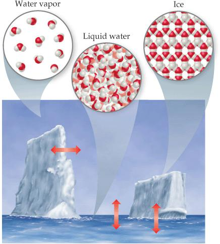
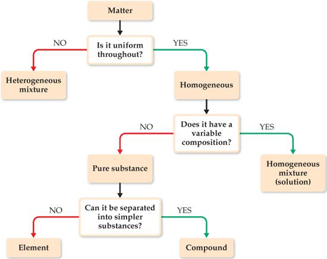
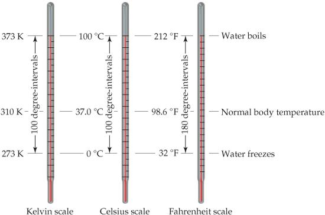

# Capítulo 2 · La materia y su medición

## El objeto de la química: materia y propiedades

**Química** es el estudio de la materia y de los cambios que esta experimenta, y por **materia** se entiende el material físico del universo: todo lo que tiene masa y ocupa espacio [@brown2012, cap. 1; @pauling1988, cap. 1; @atkins2015, cap. 1]. Una **propiedad** es cualquier característica que permite reconocer un tipo particular de materia y distinguirlo de otros; este libro, el cuerpo que lo lee y el aire que lo rodea son muestras de materia [@brown2012, cap. 1].

Experimentos incontables han mostrado que la enorme variedad de materia del mundo se debe a combinaciones de solo alrededor de cien sustancias llamadas **elementos**, y que cada elemento está compuesto por una clase única de **átomos**, los bloques de construcción casi infinitesimales de la materia [@brown2012, cap. 1; @atkins2015, cap. 1].

Las propiedades de la materia se relacionan tanto con las clases de átomos que contiene, su *composición*, como con la manera en que esos átomos se ordenan, su *estructura* [@brown2012, cap. 1]. En las **moléculas**, dos o más átomos están unidos con formas específicas, y diferencias aparentemente menores de composición o estructura pueden causar diferencias profundas de propiedades [@brown2012, cap. 1].

El etanol, alcohol de las bebidas, y el etilenglicol, líquido viscoso usado como anticongelante, contienen los mismos elementos y difieren solo en un átomo de oxígeno, pero sus efectos biológicos son opuestos [@brown2012, cap. 1]. La química piensa entonces en dos reinos: el **macroscópico**, de los objetos de tamaño ordinario, y el **submicroscópico**, de los átomos y moléculas; observamos en el primero y explicamos con el segundo [@brown2012, cap. 1; @atkins2015, cap. 1].

Pauling, por su parte, define la química como la ciencia de las **sustancias**: su estructura, sus propiedades y las reacciones que las transforman en otras [@pauling1988, cap. 1]. El universo, en su visión, está compuesto de materia y de energía radiante; la materia es cualquier tipo de masa-energía que se mueve con velocidades menores que la de la luz, y la energía radiante la que se mueve a la velocidad de la luz [@pauling1988, cap. 1].

Esta definición de Pauling es a la vez demasiado estrecha y demasiado amplia: estrecha porque el químico debe estudiar también la interacción de la luz con las sustancias, y amplia porque casi toda la ciencia cabe dentro de ella, desde la astrofísica hasta la geología [@pauling1988, cap. 1].

## Estados de la materia

Una muestra de materia puede ser **gas**, **líquido** o **sólido**, las tres **formas** o estados de la materia, que difieren en sus propiedades observables [@brown2012, cap. 1; @pauling1988, cap. 1; @atkins2015, cap. 1].{#sec-estados-materia} Un gas no tiene volumen ni forma fijos, se adapta al recipiente que lo contiene y puede comprimirse o expandirse; un líquido tiene volumen propio pero adopta la forma de la porción del recipiente que ocupa; un sólido tiene forma y volumen definidos [@brown2012, cap. 1]. Ni líquidos ni sólidos pueden comprimirse en grado apreciable [@brown2012, cap. 1].

En el nivel molecular, un gas tiene moléculas muy separadas que se mueven a gran velocidad y chocan entre sí y contra las paredes del recipiente; comprimirlo reduce el espacio entre moléculas y aumenta la frecuencia de los choques sin alterar el tamaño de las moléculas [@brown2012, cap. 1]. En un líquido, las moléculas están muy empaquetadas pero aún se mueven rápido, deslizándose unas sobre otras, lo que permite verterlo; en un sólido están sujetas con firmeza, usualmente en arreglos definidos, y solo pueden vibrar ligeramente [@brown2012, cap. 1].

Los cambios de temperatura o presión convierten un estado en otro: el hielo se funde, el vapor de agua se condensa y el líquido se congela, procesos que se llaman **cambios de estado** y que son reversibles [@brown2012, cap. 1]. Cada sustancia los experimenta a temperaturas características que sirven para identificarla, como el punto de fusión del hielo a 0 °C [@brown2012, cap. 1]. La figura @fig-estados-agua resume esas interconversiones con las flechas que unen los tres estados [@brown2012, fig. 1.4].

{#fig-estados-agua}

*Nota.* Figura reproducida de [@brown2012, fig. 1.4], © Pearson Prentice Hall (2012), reutilizada con fines educativos de estudio propio.

## Sustancias puras, elementos y compuestos

Una **sustancia pura** es materia con propiedades distintivas y composición que no varía de una muestra a otra; el agua y la sal común son ejemplos [@brown2012, cap. 1; @atkins2015, cap. 1].{#sec-sustancias-puras-mezclas} Todas las sustancias son **elementos** o **compuestos**: los elementos no pueden descomponerse en sustancias más simples y cada uno contiene una sola clase de átomos; los **compuestos** están formados por dos o más elementos y contienen dos o más clases de átomos [@brown2012, cap. 1; @atkins2015, cap. 1].

Se conocen hoy 118 elementos, aunque su abundancia varía enormemente: solo cinco, oxígeno, silicio, aluminio, hierro y calcio, suman más del 90 por ciento de la corteza terrestre, y solo tres, oxígeno, carbono e hidrógeno, más del 90 por ciento de la masa del cuerpo humano [@brown2012, cap. 1].

El agua pura, cualquiera que sea su origen, consiste en 11 por ciento de hidrógeno y 89 por ciento de oxígeno en masa, y esta constancia es la **ley de la composición constante** o **ley de las proporciones definidas**, enunciada por Joseph Louis Proust alrededor de 1800 [@brown2012, cap. 1; @pauling1988, cap. 1; @atkins2015, cap. 1].{#sec-ley-composicion-constante} Las propiedades del agua no se parecen a las de sus elementos: hidrógeno y oxígeno son gases inflamables o comburentes, mientras el agua los apaga, y cada sustancia es única porque sus moléculas son únicas [@brown2012, cap. 1].

Cuando dos materiales difieren en composición o propiedades, o son compuestos distintos o difieren en pureza; la química no ve diferencia entre el compuesto hecho en el laboratorio y el encontrado en la naturaleza, y el caso del agua lo confirma [@brown2012, cap. 1]. La ley de la composición constante vale para ambos por igual, porque lo que define al compuesto es su composición fija, no su procedencia [@brown2012, cap. 1].

## Mezclas y soluciones

La mayor parte de la materia que encontramos son **mezclas**, combinaciones de dos o más sustancias en las que cada una conserva su identidad química, y cuya composición puede variar [@brown2012, cap. 1; @atkins2015, cap. 1]. Las mezclas que no tienen la misma composición, propiedades y apariencia en todo punto son **heterogéneas**, como las rocas o la madera [@brown2012, cap. 1]. El esquema de @fig-clasificacion-materia resume el recorrido: la materia es sustancia pura o mezcla, y la pura es elemento o compuesto [@brown2012, fig. 1.9].

Las mezclas que son uniformes en todo su volumen son **homogéneas**, y a las mezclas homogéneas se las llama **soluciones** [@brown2012, cap. 1; @atkins2015, cap. 1]. El aire es una solución gaseosa de nitrógeno, oxígeno y otros gases; el azúcar y la sal disueltos en agua forman soluciones líquidas; y también existen soluciones sólidas, como las aleaciones [@brown2012, cap. 1].

Pauling precisa el vocabulario de la mezcla con los conceptos de **fase**, **constituyente** y **componente**, definidos con precisión. Una fase es una parte homogénea de un sistema, separada de las otras por límites físicos: un frasco con agua, hielo flotando y aire contiene tres fases [@pauling1988, cap. 1].

Los constituyentes de un sistema son sus fases, y un conjunto de componentes es el número mínimo de sustancias con las que podrían formarse todas las fases [@pauling1988, cap. 1]. Así, el sistema agua-hielo-aire tiene tres fases pero solo dos componentes, agua y aire, porque ambas fases acuosas pueden hacerse de una sola sustancia [@pauling1988, cap. 1].

Las mezclas se separan aprovechando diferencias de propiedades: la **filtración** separa un sólido de un líquido haciéndolo pasar por papel de filtro; la **destilación** hierve la mezcla y condensa el vapor, separando según la capacidad de las sustancias para formar gases; la **cromatografía** usa la capacidad distinta de las sustancias para adherirse a superficies sólidas [@brown2012, cap. 1; @atkins2015, cap. 1]. Una mezcla heterogénea de limaduras de hierro y oro podría separarse con un imán o disolviendo el hierro en un ácido apropiado y luego filtrando [@brown2012, cap. 1].

{#fig-clasificacion-materia}

*Nota.* Figura reproducida de [@brown2012, fig. 1.9], © Pearson Prentice Hall (2012), reutilizada con fines educativos de estudio propio.

## Propiedades físicas y químicas; cambios

Las **propiedades físicas** pueden observarse sin cambiar la identidad y la composición de la sustancia: color, olor, densidad, puntos de fusión y ebullición y dureza [@brown2012, cap. 1; @atkins2015, cap. 1].{#sec-propiedades-fisicas-quimicas} Las **propiedades químicas** describen cómo una sustancia puede reaccionar para formar otras; la inflamabilidad, la capacidad de arder en presencia de oxígeno, es un ejemplo clásico [@brown2012, cap. 1; @atkins2015, cap. 1].

Algunas propiedades, como temperatura y punto de fusión, son **intensivas**, no dependen de la cantidad de muestra y sirven para identificar sustancias; la masa y el volumen son **extensivas** porque dependen de la cantidad presente [@brown2012, cap. 1; @pauling1988, cap. 1; @atkins2015, cap. 1].{#sec-propiedades-intensivas-extensivas} La misma sustancia, en cualquier porción que se tome, conserva sus propiedades intensivas [@brown2012, cap. 1].

Pauling llama a las propiedades intensivas **propiedades intrínsecas**, características de la sustancia que no se afectan por el tamaño de la muestra ni su estado de división: la densidad del cloruro de sodio es siempre 2,163 g/cm³ y su solubilidad a 18 °C, 35,86 g en 100 g de agua [@pauling1988, cap. 1]. Otras propiedades intrínsecas medibles son el punto de fusión, la conductividad eléctrica y térmica, y la maleabilidad y ductilidad, la facilidad para ser martillado en láminas o estirado en alambres [@pauling1988, cap. 1].

El color también es una propiedad importante, y su apariencia depende del estado de subdivisión: el color se aclara al moler las partículas porque la luz penetra menos distancia antes de reflejarse [@pauling1988, cap. 1]. Por eso una misma sustancia pulverizada y en bloque puede parecer de colores distintos, y la observación debe decirlo junto al resto de las propiedades [@pauling1988, cap. 1].

Durante un **cambio físico**, la sustancia altera su apariencia física pero no su composición; la evaporación del agua es un cambio físico, y todos los **cambios de estado** lo son [@brown2012, cap. 1]. En un **cambio químico** o **reacción química**, la sustancia se transforma en otra químicamente distinta: cuando el hidrógeno arde se combina con el oxígeno y forma agua [@brown2012, cap. 1; @atkins2015, cap. 1].

Algunas reacciones son dramáticas: el cobre sumergido en ácido nítrico produce una solución verde-azulada y un gas rojo pardusco, y el propio texto de Ira Remsen de 1901 recuerda cómo «el ácido nítrico actúa sobre los pantalones» [@brown2012, cap. 1]. Las **propiedades químicas**, dice Pauling, son las que se relacionan con la participación en reacciones; el gusto y el olor están estrechamente correlacionados con la naturaleza química y se consideran propiedades químicas, pues los sentidos del olfato y del gusto son los *sentidos químicos* [@pauling1988, cap. 1].

## Unidades y el sistema internacional

Muchas propiedades de la materia son cuantitativas y exigen unidades: las científicas son las del **sistema métrico**, desarrollado en Francia a fines del siglo XVIII; en 1960 un acuerdo internacional fijó la elección métrica preferida para la ciencia, las **unidades SI** (del francés *Système International d'Unités*), con siete **unidades base** de las que derivan todas las demás [@brown2012, cap. 1; @atkins2015, cap. 1].{#sec-unidades-si} Los **prefijos** indican fracciones decimales o múltiplos: *mili* significa 10⁻³, de modo que un miligramo es 10⁻³ gramos y un milímetro 10⁻³ metros [@brown2012, cap. 1].

La unidad base de longitud es el **metro**, algo más largo que una yarda; la de masa es el **kilogramo**, igual a unas 2,2 libras, y es inusual porque usa un prefijo sobre la palabra *gramo*, por lo que a las demás unidades de masa se les añaden prefijos al gramo [@brown2012, cap. 1]. Pauling precisa las definiciones históricas: el kilogramo es la masa de un objeto patrón de aleación platino-iridio guardado en París, y una libra equivale aproximadamente a 453,59 g [@pauling1988, cap. 1].

El metro se definió primero entre dos trazos de una barra patrón de platino-iridio y en 1960 como 1.650.763,73 longitudes de onda de la línea espectral rojo-anaranjada del criptón 86; el segundo es el intervalo de 9.192.631.770 ciclos de la línea de microondas del cesio 133 [@pauling1988, cap. 1].

El volumen tiene como unidad SI el **metro cúbico**, m³; en química se usa mucho el **litro**, que equivale a 10⁻³ m³, y el mililitro es igual al centímetro cúbico: 1 mL = 1 cm³ [@pauling1988, cap. 1]. Así, un cubo de un centímetro de arista contiene exactamente un mililitro, sin importar la sustancia que lo llene [@pauling1988, cap. 1].

El **newton**, N, es la fuerza que acelera 1 kg en 1 m/s², y el **julio**, J, es el trabajo realizado por 1 newton en 1 metro: 1 J = 1 N·m [@pauling1988, cap. 1]. La **caloría** termoquímica, definida como 4,184 J, es aproximadamente la energía necesaria para elevar 1 grado la temperatura de 1 gramo de agua, y la kilocaloría (kcal o Cal) son 10³ cal [@pauling1988, cap. 1].

## Energía, masa y temperatura

Para Pauling, la distinción clásica entre materia y energía se desdibujó en 1905, cuando Einstein señaló que la energía también tiene masa y que la luz es atraída por la gravedad, verificado al observar en un eclipse que un rayo de una estrella lejana se desvía al pasar junto al Sol [@pauling1988, cap. 1]. La cantidad de masa asociada a una cantidad definida de energía la da la **ecuación de Einstein**, parte esencial de la teoría de la relatividad [@pauling1988, cap. 1; @atkins2015, cap. 1]:{#sec-ecuacion-einstein}

$$ E = m c^2 $$ {#eq-einstein}

En esta ecuación, *E* es la cantidad de energía en julios, *m* la masa en kilogramos y *c* la velocidad de la luz, 2,9979 × 10⁸ metros por segundo, una de las constantes fundamentales de la naturaleza [@pauling1988, cap. 1]. En las reacciones químicas ordinarias el cambio de masa es indetectable: al explotar 1 kg de nitroglicerina se liberan 8,0 × 10⁶ J, lo que equivale a una pérdida de masa de menos de una parte en diez mil millones [@pauling1988, cap. 1].

La ecuación se verificó experimentalmente en procesos nucleares y unió las antiguas leyes de conservación de la materia y de la energía en una sola: la **ley de conservación de la masa**, en la que la masa conservada incluye tanto la de la materia como la de la energía radiante del sistema [@pauling1988, cap. 1].

La **temperatura** es la cualidad que determina la dirección en que fluye la energía térmica: fluye del objeto a mayor temperatura al de menor [@pauling1988, cap. 1; @brown2012, cap. 1]. La escala científica es la **Celsius** o centígrada, introducida por Anders Celsius en 1742, con 0 °C en la congelación del agua saturada de aire y 100 °C en su ebullición a 1 atmósfera; la escala **Fahrenheit** de la vida cotidiana pone esos puntos en 32 °F y 212 °F [@pauling1988, cap. 1].{#sec-escalas-temperatura}

La escala **Kelvin**, ideada por Lord Kelvin, parte del **cero absoluto**, −273,15 °C, la temperatura mínima posible, y se define de modo que el punto triple del agua, donde coexisten hielo, agua líquida y vapor, sea 273,16 K [@pauling1988, cap. 1]. Como no existe temperatura menor, la escala kelvin carece de valores negativos [@pauling1988, cap. 1].

{#fig-escalas-temperatura}

*Nota.* Figura reproducida de [@brown2012, fig. 1.17], © Pearson Prentice Hall (2012), reutilizada con fines educativos de estudio propio.

La figura @fig-escalas-temperatura yuxtapone las tres escalas y muestra cuánto se desplaza cada cero [@brown2012, fig. 1.17]; las escalas Celsius y Kelvin tienen unidades del mismo tamaño, de modo que un kelvin equivale a un grado Celsius y la relación entre ambas es directa: la conversión se reduce a sumar o restar 273,15, porque solo el desplazamiento del cero separa las lecturas de las dos escalas, sin factor de escala que multiplicar [@brown2012, cap. 1]:

$$ T_{\text{K}} = T_{\text{°C}} + 273{,}15 $$ {#eq-kelvin}

Aquí, *T*K es la temperatura en kelvin y *T*°C la temperatura en grados Celsius; el cero absoluto, 0 K, corresponde a −273,15 °C [@brown2012, cap. 1]. La conversión a Fahrenheit usa el hecho de que el grado Fahrenheit es 5/9 del grado centígrado y que 0 °C coincide con 32 °F [@brown2012, cap. 1]:

$$ T_{\text{°F}} = \tfrac{9}{5}\,T_{\text{°C}} + 32 $$ {#eq-fahrenheit}

En esta fórmula, *T*°F es la temperatura en grados Fahrenheit; nótese que no se usa el símbolo de grado con el kelvin [@brown2012, cap. 1]. Un gas enfriado disminuye su volumen de manera regular, y extrapolando esa disminución se obtuvo el cero absoluto: si el volumen siguiera cayendo igual, se anularía cerca de −273 °C [@pauling1988, cap. 1].

## Densidad

La **densidad** es la cantidad de masa en una unidad de volumen de una sustancia, una propiedad intensiva que permite identificar materiales y cuya unidad habitual en química es el gramo por mililitro; en el agua vale 1,00 g/mL por la definición original del gramo [@brown2012, cap. 1; @pauling1988, cap. 1; @atkins2015, cap. 1]:{#sec-densidad}

$$ d = \frac{m}{V} $$ {#eq-densidad}

En esta definición, *d* es la densidad, *m* la masa y *V* el volumen; las densidades de sólidos y líquidos se expresan comúnmente en gramos por centímetro cúbico o gramos por mililitro [@brown2012, cap. 1]. No es casualidad que la densidad del agua sea 1,00 g/mL: el gramo se definió originalmente como la masa de 1 mL de agua a una temperatura específica [@brown2012, cap. 1].

Como la mayoría de las sustancias cambian de volumen al calentarse o enfriarse, la densidad depende de la temperatura y debe especificarse; si no se reporta, se asume 25 °C [@brown2012, cap. 1]. Quien dice que el hierro pesa más que el aire quiere decir que tiene mayor densidad: 1 kg de aire tiene la misma masa que 1 kg de hierro, pero el hierro ocupa menos volumen [@brown2012, cap. 1].

## Incertidumbre y cifras significativas

En el trabajo científico hay **números exactos**, cuyos valores se conocen con certeza, como los 12 huevos de una docena o los 2,54 cm de una pulgada, y **números inexactos**, que tienen alguna incertidumbre porque provienen de mediciones [@brown2012, cap. 1; @atkins2015, cap. 1]. Los equipos tienen limitaciones inherentes y las personas leen distinto, de modo que las mediciones repetidas varían ligeramente: *siempre existen incertidumbres en las cantidades medidas* [@brown2012, cap. 1].{#sec-cifras-significativas}

La **precisión** mide cuán de acuerdo están las mediciones individuales entre sí, y la **exactitud** cuán cerca está la medición del valor correcto o verdadero; la analogía de los dardos en la diana ilustra que un conjunto preciso puede ser inexacto si el instrumento está mal calibrado [@brown2012, cap. 1; @pauling1988, cap. 1; @atkins2015, cap. 1].{#sec-precision-exactitud} La figura @fig-precision-exactitud traslada la analogía a la química: un conjunto de mediciones agrupadas y desplazadas es preciso pero inexacto [@brown2012, fig. 1.23].

{#fig-precision-exactitud}

*Nota.* Figura reproducida de [@brown2012, fig. 1.23], © Pearson Prentice Hall (2012), reutilizada con fines educativos de estudio propio.

Todas las cifras de una cantidad medida, incluida la incierta, son **cifras significativas**; una masa reportada como 2,2 g tiene dos y una de 2,2405 g tiene cinco, y cuantas más cifras se reportan, mayor es la certeza que implica la medición; el conteo de cifras comunica el grado de certeza con que se conoce el valor [@brown2012, cap. 1].

Las reglas para contarlas son tres: los ceros entre cifras no nulas son siempre significativos (1005 kg tiene cuatro); los ceros al principio nunca lo son, pues solo ubican el punto decimal (0,02 g tiene una); y los ceros al final son significativos si el número lleva punto decimal (0,0200 g tiene tres) [@brown2012, cap. 1; @atkins2015, cap. 1].

Un número que termina en ceros sin punto decimal se asume sin esos ceros como cifras significativas, lo que vuelve ambigua la expresión 10000 g; la notación exponencial resuelve la ambigüedad: 1,03 × 10⁴ g tiene tres cifras significativas, mientras 1,0 × 10⁴ g tiene dos [@brown2012, cap. 1].

En los cálculos, la medición menos cierta limita la certeza del resultado. Para la **suma y la resta**, el resultado tiene tantos decimales como la medición con menos decimales; para la **multiplicación y la división**, tantas cifras significativas como la medición con menos cifras [@brown2012, cap. 1; @atkins2015, cap. 1]. El área de un rectángulo de 6,221 cm por 5,2 cm se reporta 32 cm², porque 5,2 tiene dos cifras significativas, y la suma 104,6 de números con una cifra decimal se reporta con una cifra decimal [@brown2012, cap. 1].

Los números exactos tienen infinitas cifras, y al redondear, si el dígito eliminado es menor que 5 el anterior se deja igual, y si es 5 o mayor se incrementa en 1: redondear 4,735 a tres cifras da 4,74 [@brown2012, cap. 1]. Esta regla se aplica también tras cada operación del cálculo, no solo al reportar el resultado final [@brown2012, cap. 1].

## Análisis dimensional

El **análisis dimensional** resuelve problemas multiplicando, dividiendo o cancelando unidades, lo que garantiza que las soluciones tengan las unidades correctas y ofrece una forma sistemática de revisar los errores [@brown2012, cap. 1; @atkins2015, cap. 1].{#sec-analisis-dimensional} La clave es el uso correcto de los **factores de conversión**, fracciones cuyo numerador y denominador son la misma cantidad expresada en unidades distintas: como 2,54 cm = 1 pulgada, pueden escribirse dos factores, uno con centímetros arriba y otro con pulgadas arriba [@brown2012, cap. 1].

Como numerador y denominador son iguales, multiplicar por un factor de conversión equivale a multiplicar por 1 y no altera el valor intrínseco de la cantidad; si las unidades deseadas no se obtienen, hay un error que la inspección suele revelar [@brown2012, cap. 1]. La práctica de *estimar* las respuestas con cifras redondeadas, el cálculo «de estadio», complementa el análisis dimensional para juzgar si una respuesta es razonable [@brown2012, cap. 1].

## Ejemplo resuelto: la energía en las cataratas del Niágara

Cuánto se calienta el agua al caer es un problema clásico de conversión de energía potencial en energía térmica, planteado por Pauling y resuelto aquí con sus cifras [@pauling1988, cap. 1]. Las cataratas del Niágara (Horseshoe) tienen 160 pies de altura; la aceleración estándar de la gravedad es 9,80665 m/s² [@pauling1988, cap. 1].

La fuerza gravitatoria sobre 1 kg en la superficie terrestre es 9,80665 N, y el cambio de energía potencial de 1 kg a una distancia vertical *h* en metros es 9,80665 × *h* julios [@pauling1988, cap. 1]. Multiplicando 0,3048 por 160 se obtiene *h* = 48,77 m, y el cambio de energía potencial produce 9,80665 × 48,77 = 478 J de energía térmica por kilogramo [@pauling1988, cap. 1].

Como elevar 1 kg de agua un grado exige 1 kcal, es decir 4184 J, el aumento de temperatura es 478 dividido entre 4184, lo que da 0,114 °C [@pauling1988, cap. 1]. Este resultado ilustra la paradoja energética del Niágara: la caída es espectacular, pero el agua solo se calienta unas décimas de grado [@pauling1988, cap. 1].

## Preguntas y ejercicios

Los ejercicios que siguen están inspirados en la tipología de @brown2012 (cap. 1) y @pauling1988 (cap. 1); los valores numéricos, los contextos y los escenarios planteados son originales de este libro, de modo que cada enunciado puede reescribirse, re-calcularse y verificarse sin recurrir al texto fuente, y todo solucionario explica el procedimiento paso a paso.

Distinga, con argumentos y ejemplos propios, entre propiedades físicas y químicas y entre propiedades intensivas y extensivas [@brown2012, cap. 1; @pauling1988, cap. 1]. Una aleación de cobre y zinc llamada latón tiene composición uniforme en toda la muestra, pero dos muestras de latón de distintos fabricantes difieren en la proporción de sus metales; clasifíquela usando el esquema de la materia [@brown2012, cap. 1]. Un frasco cerrado contiene agua líquida, hielo flotando y aire; identifique sus fases, constituyentes y un conjunto de componentes [@pauling1988, cap. 1].

Repita el análisis si el frasco contuviera una solución acuosa de sal y advierta qué cambia: la solución es una sola fase, porque el agua y la sal no se separan por límites físicos visibles en el frasco, mientras el aire sigue siendo otra fase distinta [@pauling1988, cap. 1].

Convierta la temperatura de congelación del mercurio, −40 °C, a grados Fahrenheit, y explique por qué esta temperatura es un punto notable de coincidencia entre las escalas [@pauling1988, cap. 1]. Convierta también 25 °C a kelvin y a grados Fahrenheit, usando las ecuaciones del capítulo [@brown2012, cap. 1]. Calcule la masa de 50,0 mL de mercurio si su densidad es 13,6 g/mL, y el volumen que ocuparían 65,0 g de metanol de densidad 0,791 g/mL [@brown2012, cap. 1].

Determine cuántas cifras significativas tienen las cantidades 0,05040 g; 1005 kg; 2,3 × 10⁴ cm; y 5000, y explique la regla aplicada en cada caso [@brown2012, cap. 1]. Calcule el volumen de una caja de 15,5 cm de ancho, 27,3 cm de largo y 5,4 cm de alto y repórtelo con las cifras correctas [@brown2012, cap. 1]. Convierta la masa de 115 libras a gramos con un factor de conversión y comente por qué las cifras del resultado dependen de las cifras del dato original [@brown2012, cap. 1].

## Solucionario

Las propiedades físicas se observan sin cambiar la identidad de la sustancia (color, densidad, puntos de fusión), mientras las químicas describen cómo reacciona para formar otras sustancias (inflamabilidad, corrosión) [@brown2012, cap. 1]. Las intensivas, como temperatura y punto de fusión, no dependen de la cantidad de muestra; las extensivas, como masa y volumen, sí dependen de la cantidad [@brown2012, cap. 1]. El latón es uniforme en todo su volumen, luego es homogéneo, y como su composición varía entre muestras no es un compuesto: es una solución (mezcla homogénea) [@brown2012, cap. 1].

El sistema agua-hielo-aire tiene tres fases (hielo, agua líquida, aire) cuyos constituyentes son esas fases; un conjunto de componentes es agua y aire, pues ambas fases acuosas se forman con una sola sustancia [@pauling1988, cap. 1]. La solución de sal añade una fase única, la solución, con dos componentes, agua y sal [@pauling1988, cap. 1].

Aplicando la fórmula de conversión, −40 °C se convierte en (−40 × 9/5) + 32 = −40 °F: las escalas coinciden en ese punto [@pauling1988, cap. 1]. Para 25 °C, la temperatura kelvin es 25 + 273,15 = 298,15 K, y la Fahrenheit (25 × 9/5) + 32 = 77 °F [@brown2012, cap. 1].

La masa del mercurio es 50,0 mL × 13,6 g/mL = 680 g, y el volumen del metanol, 65,0 g / 0,791 g/mL = 82,2 mL [@brown2012, cap. 1]. Las cifras significativas son cuatro para 0,05040 g (los ceros internos y finales tras el punto cuentan), cuatro para 1005 kg (ceros internos), dos para 2,3 × 10⁴ cm (el factor exponencial no aporta) y una para 5000 (ceros finales sin punto decimal no cuentan) [@brown2012, cap. 1].

El volumen de la caja es 15,5 × 27,3 × 5,4 = 2285,01 cm³, que se redondea a dos cifras: 2,3 × 10³ cm³ [@brown2012, cap. 1]. Finalmente, 115 lb × (453,6 g/1 lb) = 5,22 × 10⁴ g, con tres cifras porque el dato original tiene tres [@brown2012, cap. 1].

## Resumen del capítulo

La química estudia la materia y sus cambios; clasifica las sustancias en elementos y compuestos, y las mezclas en homogéneas y heterogéneas, y describe sus propiedades físicas y químicas, intensivas y extensivas [@brown2012, cap. 1]. La medición cuantitativa exige unidades SI, conocimiento de las escalas de temperatura y del concepto de densidad, y conciencia de la incertidumbre expresada en cifras significativas [@brown2012, cap. 1].

El análisis dimensional garantiza resultados con unidades correctas, y el método científico, desde la observación hasta la ley y la teoría, guía todo el proceso [@brown2012, cap. 1]. La ecuación de Einstein recuerda que materia y energía son intercambiables, y que la masa se conserva en el sentido amplio de la relatividad [@pauling1988, cap. 1]. Estas herramientas fundacionales se aplicarán en todos los capítulos siguientes [@brown2012, cap. 1].
