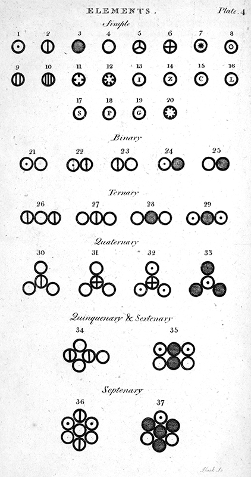
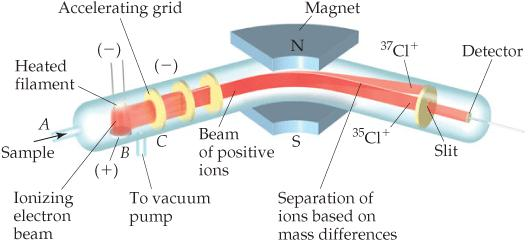
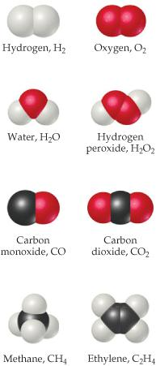
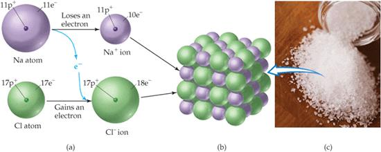
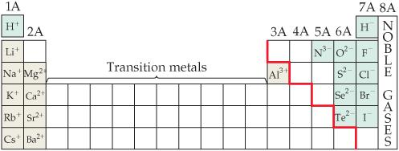

# Capítulo 3 · Átomos, moléculas e iones

## La teoría atómica de la materia

La pregunta por la naturaleza última de la materia recibió una respuesta cuantitativa cuando Dalton propuso, hacia 1805, que toda sustancia consiste en partículas diminutas de varias clases, correspondientes a los distintos elementos, a las que llamó **átomos** [@pauling1988, cap. 2; @brock2015, cap. 3; @atkins2015, cap. 2].{#sec-teoria-atomica} Su razonamiento partió de su interés meteorológico por el aire, pues para explicar la homogeneidad atmosférica propuso partículas autorrepulsivas de cada gas que no se afectan entre sí, modelo del que derivó la ley de las presiones parciales [@brock2015, cap. 3].

Quiso además construir una base cuantitativa para la química: midió densidades de gases y calculó pesos atómicos relativos desde análisis publicados, suponiendo que cuando dos elementos forman un solo compuesto este es binario, del tipo AB [@brock2015, cap. 3]. La teoría, publicada en su *New System of Chemical Philosophy* de 1808, se resume en cuatro postulados [@pauling1988, cap. 2; @brown2012, sec. 2.1].

Los elementos están hechos de partículas diminutas e indivisibles; los átomos no se crean ni se destruyen; los de un mismo elemento son idénticos y los de elementos distintos difieren en masa y propiedades; y los compuestos se forman combinando átomos en razones de números enteros pequeños [@pauling1988, cap. 2; @oriakhi2021, p. 19; @brown2012, sec. 2.1]. La figura @fig-dalton-simbolos-c3 reproduce los símbolos con que Dalton representó los elementos y sus combinaciones binarias [@brock2015, fig. 9].

{#fig-dalton-simbolos-c3}

*Nota.* Figura reproducida de [@brock2015, il. 9], © Oxford University Press (2015), reutilizada con fines educativos de estudio propio. Cortesía: Roy G. Neville Collection, Othmer Library of Chemical History, Chemical Heritage Foundation.

Estos postulados explican las leyes ponderales ya conocidas. La ley de conservación de la masa, de Lavoisier (1785), afirma que no hay cambio medible de masa durante una reacción [@pauling1988, cap. 2; @brown2012, sec. 2.1]. La ley de constantes proporciones, de Proust (1799), añade que toda muestra de un compuesto contiene sus elementos en las mismas proporciones ponderales [@pauling1988, cap. 2; @brown2012, sec. 2.1].

La ley de proporciones múltiples establece que cuando dos elementos forman más de un compuesto, los pesos de uno que reaccionan con un peso fijo del otro están en razón de números enteros pequeños: el monóxido de carbono usa el peso 4 y el dióxido el 8, en razón 1:2 [@pauling1988, cap. 2; @brown2012, sec. 2.1].

Oriakhi completa el cuadro con la ley de proporciones recíprocas: si dos elementos A y B se combinan por separado con una masa fija de un tercer D, las masas que consumen están en la misma razón que las de A y B entre sí, o en un múltiplo o fracción simple de ella [@oriakhi2021, p. 19].

## El descubrimiento de la estructura atómica

El átomo de Dalton parecía indivisible, pero a fines del siglo diecinueve varios experimentos revelaron su subestructura [@brown2012, sec. 2.2; @atkins2015, cap. 2]. En 1897 Thomson estudió los **rayos catódicos**, haces de partículas cargadas negativamente emitidas en tubos de descarga, y observó que se desvían en campos eléctricos y magnéticos [@brown2012, sec. 2.2; @atkins2015, cap. 2]. De la magnitud de la desviación midió la relación carga-masa del electrón, una partícula unas dos mil veces más ligera que el átomo de hidrógeno [@brown2012, sec. 2.2].{#sec-estructura-atomica}

En 1909 Millikan determinó con su experimento de la gota de aceite la carga del electrón, de magnitud 1,602 × 10⁻¹⁹ C, la llamada **carga electrónica** [@brown2012, sec. 2.2; @brown2012, sec. 2.3; @atkins2015, cap. 2]. En 1896 Becquerel había descubierto que minerales de uranio emiten radiación espontánea, la **radiactividad**, otra prueba de que el átomo tiene estructura interna [@brown2012, sec. 2.2; @atkins2015, cap. 2].

En 1910 Rutherford estudió cómo las láminas metálicas finas esparcen partículas alfa: casi todas la atraviesan, pocas se desvían en gran ángulo y muy pocas rebotan, lo que condujo al **modelo nuclear**, con un **núcleo** denso y cargado positivamente que concentra casi toda la masa, rodeado de electrones [@brown2012, sec. 2.2; @atkins2015, cap. 2; @pauling1988, cap. 3].{#sec-particulas-subatomicas}

El modelo nuclear explicó además el fracaso de la alquimia: convertir plomo en oro exige arrancar del núcleo protones, lo que solo logran las reacciones nucleares y no las químicas [@atkins2015, cap. 2]. Las reacciones químicas dejan intactos los núcleos y no cambian la identidad de los elementos, de modo que toda la química procede de los electrones exteriores [@atkins2015, cap. 2].

## La estructura moderna del átomo: protones, neutrones y electrones

La estructura básica del átomo es un núcleo rodeado por una nube de electrones [@pauling1988, cap. 2; @atkins2015, cap. 2; @brown2012, sec. 2.3]. El núcleo contiene **protones**, de carga positiva, y **neutrones**, eléctricamente neutros, llamados en conjunto **nucleones** y de casi idéntica masa [@pauling1988, cap. 2; @brown2012, sec. 2.3]. Los **electrones**, de carga negativa y unas dos mil veces más ligeros, se mueven en el espacio que rodea al núcleo [@pauling1988, cap. 2; @atkins2015, cap. 2; @brown2012, sec. 2.3].

Los protones están fuertemente retenidos en el núcleo [@atkins2015, cap. 2]. El **número atómico**, Z, es el número de protones del núcleo y, en un átomo neutro, también el de electrones; determina la identidad química del elemento [@pauling1988, cap. 2; @atkins2015, cap. 2; @brown2012, sec. 2.3]. El **número másico**, A, es la suma de protones y neutrones, A = Z + N, y la notación general escribe la superíndice y la subíndice a la izquierda del símbolo, ${}^{A}_{Z}\text{E}$ [@oriakhi2021, p. 20].{#sec-numero-atomico-masico} Las propiedades de las tres partículas centrales se resumen a continuación [@oriakhi2021, p. 19].

| Partícula | Ubicación | Masa (g) | Masa (uma) | Carga |
| :--- | :--- | :--- | :--- | :--- |
| Electrón | Fuera del núcleo | 9,110 × 10⁻²⁸ | 0,00549 | 1− |
| Protón | Dentro del núcleo | 1,673 × 10⁻²⁴ | 1,0073 | 1+ |
| Neutrón | Dentro del núcleo | 1,675 × 10⁻²⁴ | 1,0087 | 0 |

Los **isótopos** son átomos del mismo elemento, con igual número atómico pero distinto número másico por tener distinto número de neutrones [@brown2012, sec. 2.3; @oriakhi2021, p. 21; @atkins2015, cap. 2].{#sec-isotopos} Comparten las propiedades químicas, reveladas por los electrones, pero difieren en las físicas, vinculadas a la masa [@oriakhi2021, p. 21].

La notación nuclear se extiende a los iones contando además los electrones: el calcio, con número atómico 20 y número másico 40, tiene veinte protones y veinte neutrones, y al formar el catión Ca²⁺ pierde dos electrones y conserva dieciocho [@oriakhi2021, p. 20]. En un anión la cuenta crece, pues el nitrógeno, con siete protones y diez electrones tras ganar tres, forma el N³⁻, y el mismo razonamiento reconstruye protones, neutrones y electrones de cualquier símbolo nuclear [@oriakhi2021, p. 20]. El hidrógeno tiene tres isótopos: el ordinario, un protón sin neutrones; el deuterio, un protón y un neutrón, que forma el agua pesada, unos 10% más densa que la ordinaria; y el tritio, radiactivo, con periodo de semidesintegración de 12,3 años [@atkins2015, cap. 2].

## Masas atómicas y peso atómico

Los elementos se ordenan por su número atómico, y los neutrones son solo acompañantes del núcleo: variarlos no altera la identidad química [@atkins2015, cap. 2; @brown2012, sec. 2.4]. Las masas de los átomos individuales son demasiado pequeñas para expresarse en gramos: un átomo de calcio pesa unos 6,64 × 10⁻²³ g [@oriakhi2021, p. 22]. Por eso se usa una **escala relativa**: el carbono-12 define doce **unidades de masa atómica** (uma), y una uma, 1,66054 × 10⁻²⁴ g, es un doceavo de esa masa [@brown2012, sec. 2.4; @atkins2015, cap. 2].

La **masa atómica relativa** de un elemento compara la masa de uno de sus átomos con ese doceavo [@oriakhi2021, p. 22; @brown2012, sec. 2.4]. Como en la naturaleza los elementos son mezclas de isótopos, el peso atómico que se lee en la tabla es un promedio ponderado por la abundancia [@oriakhi2021, p. 22; @brown2012, sec. 2.4].

Para calcular el peso atómico se multiplica la masa exacta de cada isótopo por su abundancia fraccionaria y se suman los productos [@brown2012, sec. 2.4; @oriakhi2021, p. 23; @atkins2015, cap. 2]. El carbono natural, con 98,89% de carbono-12 y 1,11% de carbono-13, da (12,00000 × 0,9889) + (13,00335 × 0,0111) = 12,011 uma [@oriakhi2021, p. 23]. Este procedimiento vale para todos los elementos de la tabla periódica [@brown2012, sec. 2.4].

El **espectrómetro de masas** es el instrumento más exacto para medirlas: ioniza una muestra gaseosa, la acelera y la desvía en un campo magnético, separando las partículas según su masa y registrando su abundancia relativa [@brown2012, sec. 2.4; @atkins2015, cap. 2]. La figura @fig-espectrometro-masas esquematiza el aparato y las trayectorias de los isótopos del cloro [@brown2012, fig. 2.12].

{#fig-espectrometro-masas}

*Nota.* Figura reproducida de [@brown2012, fig. 2.12], © Pearson Prentice Hall (2012), reutilizada con fines educativos de estudio propio.

## La tabla periódica

La lista de elementos creció durante el siglo diecinueve y se buscaron patrones en sus comportamientos, esfuerzo que culminó en 1869 con la tabla periódica [@brown2012, sec. 2.5; @pauling1988, cap. 5; @brock2015, cap. 5; @atkins2015, cap. 2].{#sec-tabla-periodica} Las filas horizontales se llaman **períodos** y las columnas **grupos**; los períodos tienen 2, 8, 8, 18 y 18 elementos, y el sexto, 32, separa catorce miembros (atómicos 57–70) al pie de la página [@brown2012, sec. 2.5].

Ordenados por número atómico creciente, los elementos muestran propiedades físicas y químicas periódicas: los metales blandos y reactivos litio, sodio y potasio aparecen cada uno tras un gas poco reactivo, helio, neón y argón [@brown2012, sec. 2.5; @atkins2015, cap. 2]. La **tabla periódica** es el instrumento más importante para organizar y recordar hechos químicos, pues los elementos de una columna, por compartir arreglos electrónicos periféricos, tienden a comportarse igual [@brown2012, sec. 2.5; @atkins2015, cap. 2; @pauling1988, cap. 5].

Las etiquetas de los grupos admiten varias convenciones: la norteamericana con A y B, la europea análoga y la de la IUPAC que numera del 1 al 18 [@brown2012, sec. 2.5]. Los **metales** dominan la izquierda y el centro, brillan y conducen bien; los **no metales**, la superior derecha, separados por la línea escalonada; y los **metaloides**, sobre la línea, son intermedios [@brown2012, sec. 2.5; @atkins2015, cap. 2].

## Moléculas y compuestos moleculares

Solo los gases nobles se encuentran normalmente como átomos aislados; la mayor parte de la materia está hecha de moléculas o iones [@brown2012, sec. 2.6; @atkins2015, cap. 2].{#sec-moleculas-compuestos-moleculares} Varios elementos existen en forma molecular, como el oxígeno del aire, cuyas moléculas tienen dos átomos y se escriben O₂, donde el subíndice cuenta los átomos; una molécula de dos es **diatómica** [@brown2012, sec. 2.6]. Los elementos diatómicos normales son hidrógeno, oxígeno, nitrógeno y los halógenos: H₂, O₂, N₂, F₂, Cl₂, Br₂ e I₂ [@brown2012, sec. 2.6; @atkins2015, cap. 2].

Los compuestos formados por moléculas se llaman **compuestos moleculares** y contienen casi solo no metales [@brown2012, sec. 2.6; @atkins2015, cap. 2]. El ozono, O₃, muestra cuánto importa la composición: es tóxico y de olor penetrante, mientras el O₂ es esencial e inodoro [@brown2012, sec. 2.6]. Las **fórmulas moleculares** dan el número real de átomos en la molécula, y las **fórmulas empíricas** el número relativo en la razón entera mínima [@brown2012, sec. 2.6; @atkins2015, cap. 2].{#sec-formulas-quimicas} El peróxido de hidrógeno, H₂O₂, tiene empírica HO; el etileno, C₂H₄, empírica CH₂; y el agua coincide en ambas, H₂O [@brown2012, sec. 2.6].

{#fig-modelos-moleculares}

*Nota.* Figura reproducida de [@brown2012, fig. 2.18], © Pearson Prentice Hall (2012), reutilizada con fines educativos de estudio propio.

La fórmula molecular resume la composición, pero la **fórmula estructural** muestra qué átomo está unido a cuál, con líneas por enlace [@brown2012, sec. 2.6; @atkins2015, cap. 2]. Conocida la molecular se deduce la empírica, pero no al revés sin datos adicionales, y por eso algunos métodos de análisis conducen primero solo a la empírica [@brown2012, sec. 2.6].

Los **modelos de bolas y varillas** representan los ángulos entre enlaces con fidelidad, mientras los **modelos de llenado de espacio** muestran los tamaños relativos de los átomos [@brown2012, sec. 2.6]. La figura @fig-modelos-moleculares compara ambas representaciones y muestra cómo las fórmulas químicas corresponden a las composiciones que representan [@brown2012, sec. 2.6; fig. 2.18].

## Iones y compuestos iónicos

Algunos átomos ganan o pierden electrones con facilidad, y la partícula cargada resultante es un **ion**: **catión** si lleva carga positiva y **anión** si negativa [@brown2012, sec. 2.7; @atkins2015, cap. 2].{#sec-iones-compuestos-ionicos} Los superíndices +, 2+ y 3+ representan la pérdida de uno, dos y tres electrones, y −, 2− y 3− su ganancia [@brown2012, sec. 2.7]. Los átomos metálicos tienden a perder electrones y formar cationes, y los no metálicos a ganarlos y formar aniones; los **compuestos iónicos**, eléctricamente neutros, combinan así metales con no metales, como el cloruro de sodio [@brown2012, sec. 2.7; @atkins2015, cap. 2].

Cuando un átomo de sodio reacciona con uno de cloro, se transfiere un electrón del primero al segundo, formando Na⁺ y Cl⁻, que se atraen y forman NaCl [@brown2012, sec. 2.7]. La figura @fig-formacion-nacl muestra la transferencia del electrón y la red tridimensional que resulta; los compuestos iónicos se forman así, por transferencia de electrones [@brown2012, fig. 2.21; sec. 2.7].

Sus iones se ordenan en estructuras tridimensionales, de modo que no existe una molécula discreta de NaCl y solo puede escribirse una fórmula empírica [@brown2012, sec. 2.5]. Las cargas se equilibran: un Ba²⁺ por dos Cl⁻ (BaCl₂), y si las magnitudes difieren, el número sin signo de un ion es el subíndice del otro, como en Mg₃N₂ [@brown2012, sec. 2.7].

{#fig-formacion-nacl}

*Nota.* Figura reproducida de [@brown2012, fig. 2.21], © Pearson Prentice Hall (2012), reutilizada con fines educativos de estudio propio.

Además de iones simples como Na⁺ y Cl⁻ existen **iones poliatómicos**, átomos unidos pero con carga neta: el amonio, NH₄⁺, y el sulfato, SO₄²⁻ [@brown2012, sec. 2.7; @atkins2015, cap. 2]. Muchos iones buscan el mismo número de electrones que el gas noble más cercano: el sodio queda con diez al perder uno, como el neón, y el cloro con dieciocho al ganarlo, como el argón [@brown2012, sec. 2.7]. La figura @fig-cargas-iones resume las cargas predecibles de los iones comunes a uno y otro lado de la línea escalonada [@brown2012, fig. 2.20].

La tabla periódica resume las cargas comunes: los grupos 1A forman 1+, los 2A 2+, los 7A 1− y los 6A 2− [@brown2012, sec. 2.7].

{#fig-cargas-iones}

*Nota.* Figura reproducida de [@brown2012, fig. 2.20], © Pearson Prentice Hall (2012), reutilizada con fines educativos de estudio propio.

## Nomenclatura de los compuestos inorgánicos

Los nombres y fórmulas de los compuestos son el vocabulario esencial de la química, y las reglas que los nombran constituyen la **nomenclatura química** [@brown2012, sec. 2.8; @atkins2015, cap. 2].{#sec-nomenclatura-inorganica} Ante más de cincuenta millones de sustancias, se necesita un conjunto de reglas que conduzca a un nombre único e informativo basado en la composición [@brown2012, sec. 2.8]. La división mayor es entre compuestos orgánicos, que contienen carbono e hidrógeno, e inorgánicos, el resto [@brown2012, sec. 2.8].

Los cationes metálicos llevan el nombre del metal, y si este forma varias cargas, se indica la carga con un número romano: el Fe²⁺ es hierro(II) y el Fe³⁺ hierro(III) [@brown2012, sec. 2.8]. Los cationes de no metales terminan en *-io*, como el amonio [@brown2012, sec. 2.8]. Los aniones monoatómicos se nombran con terminación *-uro*: cloro da cloruro, Cl⁻ [@brown2012, sec. 2.8]. Los aniones que contienen oxígeno, los **oxianiones**, terminan en *-ato* en su forma representativa y en *-ito* en la que tiene un oxígeno menos [@brown2012, sec. 2.8].

Un **ácido** es una sustancia cuyas moléculas ceden iones H⁺ al formar una disolución acuosa, y se nombra según su anión [@brown2012, sec. 2.8; @atkins2015, cap. 2]. Los ácidos de aniones terminados en *-uro* cambian esa terminación por *-hídrico* y anteponen *hidro-*: CN⁻, el cianuro, da el ácido cianhídrico [@brown2012, sec. 2.8].

Los derivados de oxianiones en *-ato* cambian a *-ico* (el nitrato da el ácido nítrico) y los de *-ito* a *-oso*: el sulfito da el ácido sulfuroso [@brown2012, sec. 2.8]. Los compuestos moleculares binarios se nombran con el elemento más a la izquierda primero, terminación *-uro* y prefijos griegos *mono-, di-, tri-*, aunque *mono-* nunca acompaña al primer elemento [@brown2012, sec. 2.8].

## Introducción a la química orgánica

El estudio de los compuestos del carbono es la **química orgánica** [@brown2012, sec. 2.9; @atkins2015, cap. 2].{#sec-quimica-organica-intro} Los compuestos que solo contienen carbono e hidrógeno son **hidrocarburos**, y en su clase más simple, los **alcanos**, cada carbono se enlaza a cuatro átomos [@brown2012, sec. 2.9]. Los tres menores son metano, CH₄; etano, C₂H₆; y propano, C₃H₈, y no se nombran como los inorgánicos, sino con terminación *-ano*: el de cuatro carbonos es butano y el de ocho octano, C₈H₁₈ [@brown2012, sec. 2.9].

Otras clases de compuestos se obtienen reemplazando un hidrógeno del alcano por un **grupo funcional**, como el grupo OH [@brown2012, sec. 2.9]. Un **alcohol** resulta así de sustituir un H por OH, y su nombre deriva del alcano añadiendo *-ol*: el metanol y el etanol, líquidos incoloros, vienen del metano y el etano gaseosos [@brown2012, sec. 2.9]. Los compuestos con igual fórmula molecular pero distinto arreglo atómico son **isómeros**; el 1-propanol y el 2-propanol son **isómeros estructurales**, y el número indica en qué carbono se enlazó el OH [@brown2012, sec. 2.9].

La riqueza orgánica proviene de las largas cadenas de enlaces carbono-carbono: los alcanos pueden extenderse miles de átomos, como en el polietileno, un sólido usado en miles de productos plásticos [@brown2012, sec. 2.9]. La introducción de hoy prepara el camino para el tratamiento completo de la química del carbono en capítulos posteriores [@brown2012, sec. 2.9].

## Ejemplo resuelto: el peso atómico del cloro

El cloro natural es una mezcla de cloro-35, masa 34,9689 uma y abundancia 75,76%, y cloro-37, masa 36,9659 uma y abundancia 24,24% [@oriakhi2021, p. 25]. El peso atómico se obtiene multiplicando cada masa por su abundancia fraccionaria y sumando: (34,9689 × 0,7576) + (36,9659 × 0,2424) = 26,492 + 8,961 = 35,45 uma, el valor de la tabla [@oriakhi2021, p. 25]. El promedio queda entre ambas masas y más cerca de la del isótopo más abundante, el cloro-35 [@brown2012, sec. 2.4]. El procedimiento se reutilizará con el peso molecular [@oriakhi2021, p. 23].

## Preguntas y ejercicios

Los ejercicios que siguen están inspirados en la tipología de @brown2012 (cap. 2), @pauling1988 (caps. 2-3) y @oriakhi2021 (cap. 1); los valores numéricos, los contextos y los escenarios planteados son originales de este libro, de modo que cada enunciado puede reescribirse, re-calcularse y verificarse sin recurrir al texto fuente, y todo solucionario explica el procedimiento paso a paso.

Explique la diferencia entre hipótesis, teoría y ley, y clasifique la afirmación de que los átomos de un elemento son idénticos y difieren de los de otros [@pauling1988, cap. 2]. Escriba en notación nuclear el ion ${}^{23}_{11}\text{Na}^{+}$ y determine sus protones, neutrones y electrones, y repita para ${}^{16}_{8}\text{O}^{2-}$, ${}^{56}_{26}\text{Fe}^{3+}$ y ${}^{63}_{29}\text{Cu}$ [@oriakhi2021, p. 20]. Identifique cuáles de los pares ${}^{18}_{9}\text{F}$ / ${}^{18}_{10}\text{Ne}$, ${}^{2}_{1}\text{H}$ / ${}^{3}_{1}\text{H}$ y ${}^{40}_{19}\text{K}$ / ${}^{40}_{20}\text{Ca}$ son isótopos, y justifique [@oriakhi2021, p. 22].

Calcule el peso atómico del litio, mezcla de 7,5% de ${}^{6}\text{Li}$ y 92,5% de ${}^{7}\text{Li}$ con masas 6,01 y 7,02 uma [@oriakhi2021, p. 23]. El boro, de peso atómico 10,81, es una mezcla de ${}^{10}\text{B}$, masa 10,01294 uma, y ${}^{11}\text{B}$, masa 11,00931 uma; halle la abundancia fraccionaria de cada uno [@oriakhi2021, p. 23]. Escriba las fórmulas empíricas de los compuestos de Al³⁺ con O²⁻ y de Mg²⁺ con N³⁻, justificando los subíndices por la neutralidad eléctrica [@brown2012, sec. 2.7].

Nombre los compuestos iónicos K₂SO₄, Ba(OH)₂ y FeCl₃, y escriba las fórmulas de sulfuro de potasio, hidrogenocarbonato de calcio y perclorato de níquel(II) [@brown2012, sec. 2.8]. Nombre los ácidos HCN, HNO₃, H₂SO₄ y H₂SO₃, y los compuestos moleculares SO₂, PCl₅ y Cl₂O₃ [@brown2012, sec. 2.8]. Escriba la fórmula estructural y molecular del pentano lineal y diga cuántos isómeros estructurales de propanol existen [@brown2012, sec. 2.9].

## Solucionario

Una hipótesis es una idea que explica hechos; si sobrevive a las pruebas se llama teoría o ley, y una ley resume lo observado sin explicarlo [@pauling1988, cap. 2]. Para ${}^{23}_{11}\text{Na}^{+}$: 11 protones, 23 − 11 = 12 neutrones y, por la carga +1, 10 electrones; para ${}^{16}_{8}\text{O}^{2-}$, 8 protones, 8 neutrones y 10 electrones; para ${}^{56}_{26}\text{Fe}^{3+}$, 26, 30 y 23; y para ${}^{63}_{29}\text{Cu}$, 29, 34 y 29 [@oriakhi2021, p. 20]. Solo ${}^{2}_{1}\text{H}$ y ${}^{3}_{1}\text{H}$ son isótopos, por compartir el número atómico [@oriakhi2021, p. 22].

El peso atómico del litio es (6,01 × 0,075) + (7,02 × 0,925) = 0,451 + 6,494 = 6,94 uma [@oriakhi2021, p. 23]. Si X es la fracción de ${}^{10}\text{B}$, 10,81 = 10,01294X + 11,00931(1 − X), cuya solución da X = 0,20: 20% de ${}^{10}\text{B}$ y 80% de ${}^{11}\text{B}$ [@oriakhi2021, p. 23].

El compuesto de Al³⁺ y O²⁻ es Al₂O₃, con 2 × (3+) = 6+ frente a 3 × (2−) = 6−, y el de Mg²⁺ con N³⁻ es Mg₃N₂, con 3 × (2+) = 6+ frente a 2 × (3−) = 6− [@brown2012, sec. 2.7]. En ambos casos la neutralidad eléctrica fija los subíndices de la fórmula empírica [@brown2012, sec. 2.7].

K₂SO₄ es sulfato de potasio, Ba(OH)₂ hidróxido de bario y FeCl₃ cloruro de hierro(III) [@brown2012, sec. 2.8]. El sulfuro de potasio es K₂S, el hidrogenocarbonato de calcio Ca(HCO₃)₂ y el perclorato de níquel(II) Ni(ClO₄)₂ [@brown2012, sec. 2.8]. Los ácidos son cianhídrico, nítrico, sulfúrico y sulfuroso; los compuestos moleculares, dióxido de azufre, pentacloruro de fósforo y trióxido de dicloro [@brown2012, sec. 2.8]. El pentano lineal, con cinco carbonos en cadena, tiene fórmula molecular C₅H₁₂ y fórmula estructural CH₃CH₂CH₂CH₂CH₃, y existen dos isómeros de propanol, el 1-propanol y el 2-propanol [@brown2012, sec. 2.9].

## Resumen del capítulo

La teoría atómica de Dalton explica las leyes ponderales, y los experimentos de Thomson, Millikan, Becquerel y Rutherford revelaron el núcleo y los electrones [@pauling1988, cap. 2; @brown2012, sec. 2.2]. El número atómico fija la identidad, el número másico la masa nuclear, y los isótopos comparten la primera y varían la segunda [@atkins2015, cap. 2; @oriakhi2021, p. 20]. El peso atómico es un promedio ponderado de las masas isotópicas [@oriakhi2021, p. 23]. Las moléculas, los iones, las fórmulas químicas y la nomenclatura inorgánica y orgánica completan el vocabulario del libro [@brown2012, sec. 2.6; @brown2012, sec. 2.8; @brown2012, sec. 2.9].
