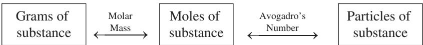

# Estequiometría: moles, fórmulas y ecuaciones químicas

## Introducción

Toda reacción química se describe con una **ecuación química**, la escritura compacta que muestra las sustancias que reaccionan y las que se producen [@brown2012, sec. 3.1; @atkins2015, cap. 2].{#sec-ecuaciones-quimicas} Cuando el gas hidrógeno arde, reacciona con el oxígeno del aire para formar agua, y esa transformación se escribe como dos moléculas de hidrógeno gaseoso más una de oxígeno gaseoso que producen dos moléculas de agua [@brown2012, sec. 3.1].

El signo más de la ecuación se lee "reacciona con" y la flecha se lee "produce"; las fórmulas de la izquierda representan los **reactivos**, las de la derecha los **productos**, y los números delante de las fórmulas, llamados **coeficientes**, indican el número relativo de moléculas de cada clase que participan en la reacción [@brown2012, sec. 3.1; @atkins2015, cap. 2]. Como en las ecuaciones algebraicas, el coeficiente uno no se escribe, y toda la notación queda lista para contar átomos y moles [@brown2012, sec. 3.1].

## Ecuaciones químicas y su balanceo

Toda reacción química conserva la materia: como los átomos no se crean ni se destruyen, una ecuación química debe tener el mismo número de átomos de cada elemento a ambos lados de la flecha, y cuando se cumple esa condición se dice que la ecuación está **balanceada** [@brown2012, sec. 3.1; @atkins2015, cap. 2; @pauling1988, cap. 4].

El conteo que exige el balanceo recurre a una operación sencilla: dos moléculas de agua contienen cuatro átomos de hidrógeno y dos de oxígeno, y el número de cada átomo se obtiene multiplicando el subíndice de la fórmula por su coeficiente [@brown2012, sec. 3.1]. La notación 3 Mg(OH)₂, por ejemplo, representa tres átomos de magnesio, seis de oxígeno y seis de hidrógeno, y esa cuenta previa garantiza que la ecuación final tenga el mismo número de cada elemento en los dos lados [@brown2012, sec. 3.1].

Conocidas las fórmulas de reactivos y productos, se escribe la ecuación sin balancear y luego se determinan los coeficientes que igualan los átomos de cada elemento en los dos lados; para la mayoría de los propósitos la ecuación balanceada debe usar los coeficientes enteros más pequeños posibles [@brown2012, sec. 3.1; @atkins2015, cap. 2].

La distinción entre subíndice y coeficiente es la llave del balanceo: los subíndices alteran la identidad de la sustancia, mientras los coeficientes alteran solo su cantidad [@brown2012, sec. 3.1; fig. 3.3]. El dióxido de carbono CO₂ y dos moléculas de monóxido de carbono, 2 CO, contienen la misma cantidad de carbono pero describen sustancias distintas, y por eso nunca se balancea cambiando un subíndice a ciegas [@brown2012, sec. 3.1; fig. 3.3].

La combustión del butano, el combustible de los encendedores de un solo uso, ilustra un balanceo completo: dos moléculas de butano reaccionan con trece de oxígeno para producir ocho de dióxido de carbono y diez de agua [@brown2012, sec. 3.6]. Este patrón pertenece a los pocos tipos de reacción de reconocimiento inmediato, como la combinación, la descomposición y la combustión, que se estudiaron en el capítulo anterior y que ayudan a anticipar los productos antes de balancear [@brown2012, sec. 3.2].

## Masa fórmula, masa molecular y masa molar

La **masa fórmula** de una sustancia se calcula multiplicando la masa atómica de cada elemento por el número de veces que aparece en la fórmula y sumando los resultados [@oriakhi2021, p. 27; @brown2012, sec. 3.3; @pauling1988, cap. 4].{#sec-masa-formula-molecular-molar} En el sulfato de magnesio, un átomo de magnesio aporta 24,30 uma, uno de azufre 32,07 uma y cuatro de oxígeno 64,00 uma, lo que da 120,37 uma; la edición de Oriakhi imprime por error la masa del azufre como 23,07 uma y la suma como 111,37 uma, descuido que contradice las masas atómicas que el propio libro emplea en sus ejemplos [@oriakhi2021, p. 28]. Cuando la sustancia está formada por moléculas la misma suma recibe el nombre de **masa molecular** [@oriakhi2021, p. 27; @brown2012, sec. 3.3].

El valor numérico de la masa fórmula en uma es idéntico al de la masa molar en gramos por mol [@oriakhi2021, p. 27; @pauling1988, cap. 4; @brown2012, sec. 3.3]. La masa molecular del agua es la suma de dos veces la masa atómica del hidrógeno, 2 × 1,00797, más la del oxígeno, 15,9994, que da 18,0153 [@pauling1988, cap. 4], y el mismo cálculo se repite para cualquier compuesto con masas atómicas conocidas [@oriakhi2021, p. 27].

El término **masa molar** se usa hoy como concepto general para masa fórmula y masa molecular: es la masa en gramos de exactamente un mol de la sustancia y es numéricamente igual a la masa fórmula expresada en uma [@oriakhi2021, p. 27; @brown2012, sec. 3.3; @pauling1988, cap. 4]. La masa fórmula de la glucosa, C₆H₁₂O₆, es 180,0 uma, de modo que la masa molar es 180,0 gramos, y para la mayoría de los problemas conviene redondear las masas atómicas a una cifra decimal [@oriakhi2021, p. 27].

Las conversiones de este capítulo se apoyan en una sola relación: la cantidad de sustancia es el cociente entre la masa de la muestra y la masa molar, que crece con la primera y decrece con la segunda, y esa relación, que se escribe como

$$n = \frac{m}{M}$$ {#eq-moles}

donde $n$ es la cantidad de sustancia en moles, $m$ es la masa de la muestra en gramos y $M$ es la masa molar en gramos por mol; la cantidad crece sin límite conforme aumenta la masa a masa molar constante y tiende a cero cuando la muestra se hace mínima, de modo que un mismo cálculo sirve para cualquier sustancia con masa molar conocida [@oriakhi2021, p. 31; @brown2012, sec. 3.4].

La masa molar escala a moléculas enormes sin cambiar el método: la hemoglobina, la proteína que transporta oxígeno en la sangre, tiene fórmula C₂₉₅₂H₄₆₆₄N₈₁₂S₈Fe₄ y masa molar 51.936 g por mol, suma de 2.952 carbonos, 4.664 hidrógenos, 812 nitrógenos, 8 azufres y 4 hierros [@oriakhi2021, p. 33; @brown2012, sec. 3.4]. Una muestra de 25,000 g contiene 0,4814 mol, y en ella hay 5472 g de nitrógeno, 123,2 g de azufre y 107,8 g de hierro, cifras que muestran cómo la relación n = m/M tiende el puente entre la balanza y la fórmula [@oriakhi2021, pp. 33-34].

## El mol y el número de Avogadro

Incluso las muestras más pequeñas de laboratorio contienen cantidades enormes de átomos, iones o moléculas; una cucharadita de agua, unos cinco mililitros, contiene cerca de dos por diez a la veintitrés moléculas, un número tan grande que casi desafía la comprensión [@brown2012, sec. 3.4; @atkins2015, cap. 2].{#sec-mol-numero-avogadro} Los químicos usan para contarlas una unidad de conteo análoga a la docena o la gruesa: el **mol**, abreviado mol, definido como la cantidad de materia que contiene tantos objetos como átomos hay en exactamente doce gramos de carbono-12 isotópicamente puro [@brown2012, sec. 3.4; @atkins2015, cap. 2].

Los experimentos han determinado ese número como 6,0221421 × 10²³, que suele redondearse a 6,02 × 10²³, y se llama **número de Avogadro**, $N_A$, en honor del científico italiano Amedeo Avogadro (1776–1856) [@brown2012, sec. 3.4]. Pauling reporta en su edición de 1988 el valor 0,60229 × 10²⁴, la misma magnitud con distinta notación y un redondeo más antiguo, una discrepancia histórica que no cambia los cálculos [@pauling1988, cap. 4].

Un mol de átomos, un mol de moléculas o un mol de cualquier otra entidad contienen todos el número de Avogadro de objetos; la relación entre la cantidad y las partículas es la puerta de entrada al conteo microscópico, porque multiplica lo macroscópico por la constante de Avogadro, y se escribe como

$$N = n \times N_A$$ {#eq-avogadro}

donde $N$ es el número de partículas sin unidades, $n$ la cantidad en moles y $N_A$ el número de Avogadro, 6,02 × 10²³ mol⁻¹, que se lee "inverso de mol" o "por mol" y recuerda que hay 6,02 × 10²³ objetos por cada mol [@brown2012, sec. 3.4; @atkins2015, cap. 2]. La conversión inversa divide el número de partículas entre $N_A$ para recuperar los moles, y ambas direcciones se usan indistintamente en los cálculos de la estequiometría [@oriakhi2021, p. 31; @brown2012, sec. 3.4].

Oriakhi resume los seis factores de conversión entre masa, moles y partículas en un diagrama que llama el mapa del mol, reproducido en la figura @fig-mol-map-c4: de los moles a los gramos se multiplica por la masa molar, de los gramos a los moles se divide por ella, y de los moles a las partículas se multiplica por el número de Avogadro, con sus recíprocos en las direcciones inversas [@oriakhi2021, p. 31; @brown2012, sec. 3.4].

{#fig-mol-map-c4}

*Nota.* Figura reproducida de [@oriakhi2021, p. 31], © Oxford University Press (2021), reutilizada con fines educativos de estudio propio.

Un mol de glucosa contiene el mismo número de moléculas de glucosa que átomos de carbono hay en doce gramos de carbono-12, y un mol de iones sulfato contiene el número de Avogadro de iones sulfato [@oriakhi2021, cap. 3; @pauling1988, cap. 4; @brown2012, sec. 3.4]. Pauling anota que un mol de moléculas de yodo, I₂, son 253,8088 gramos de yodo, el doble del gramo-átomo de yodo, 126,9044 gramos, y recomienda distinguir, para evitar confusiones, entre mol de átomos y mol de moléculas [@pauling1988, cap. 4].

## Composición porcentual

La **composición porcentual** de un compuesto expresa la masa de cada elemento presente en cien unidades de masa del compuesto, y resulta especialmente útil porque es independiente del tamaño de la muestra [@oriakhi2021, p. 36; @brown2012, sec. 3.5; @pauling1988, cap. 4].{#sec-composicion-porcentual} Un compuesto de 73,9% de mercurio y 26,1% de cloro por masa contiene esas proporciones en cualquier cantidad que se tome, y el cálculo se organiza con la fórmula

$$\% E = \frac{m_E}{M} \times 100$$ {#eq-porcentaje}

donde $\% E$ es el porcentaje en masa del elemento $E$, $m_E$ es la masa de ese elemento contenida en un mol del compuesto, calculada multiplicando la masa atómica por el subíndice, y $M$ es la masa molar total [@oriakhi2021, p. 36; @brown2012, sec. 3.5]. Si el elemento representa casi toda la masa molar, el porcentaje se acerca a cien, y si es un componente menor, se acerca a cero, siempre dentro de una suma que debe dar cien por ciento [@oriakhi2021, p. 36].

Los **hidratos** son compuestos iónicos que cristalizan con moléculas de agua fijas en la red, las **aguas de hidratación**, y su porcentaje se calcula igual, tomando la masa del agua en la fórmula hidratada [@oriakhi2021, p. 37; @brown2012, sec. 3.5]. El sulfato de cobre(II) pentahidratado, CuSO₄·5H₂O, con masa fórmula 249,61, contiene 90 de agua, esto es 36,06% [@oriakhi2021, p. 38]. El carbonato de sodio decahidratado, Na₂CO₃·10H₂O, de masa 286, lleva 180 de agua, 62,94%, y el nitrato de zinc hexahidratado, Zn(NO₃)₂·6H₂O, de masa 297,38, lleva 108, 36,32% [@oriakhi2021, p. 38]; con ese porcentaje se predice cuánta agua libera al secarse una masa dada de hidrato [@oriakhi2021, p. 38].

## Fórmula empírica y molecular

La **fórmula empírica** expresa el número relativo de átomos de cada elemento en la sustancia, con los subíndices enteros más pequeños que dan la razón [@brown2012, sec. 3.5; @atkins2015, cap. 2].{#sec-formula-empirica-molecular} La del agua, H₂O, indica dos átomos de hidrógeno por uno de oxígeno, y esa razón se mantiene en el nivel molar [@brown2012, sec. 3.5].

Un compuesto de mercurio y cloro que es 73,9% mercurio y 26,1% cloro por masa contiene en una muestra de 100,0 g exactamente 73,9 g de mercurio y 26,1 g de cloro [@brown2012, sec. 3.5]. Dividiendo cada masa por su masa molar se obtienen los moles: 73,9 g de mercurio sobre 200,59 g por mol dan 0,368 mol, y 26,1 g de cloro sobre 35,45 g por mol dan 0,736 mol [@brown2012, sec. 3.5].

Al dividir el número mayor de moles entre el menor se obtiene la razón 1,99, tan próxima a dos que se concluye con confianza que la fórmula empírica es HgCl₂, porque los subíndices de una fórmula empírica son los enteros más pequeños que expresan la razón de átomos presentes [@brown2012, sec. 3.5; @atkins2015, cap. 2]. Los valores calculados de las razones molares pueden no ser enteros por errores experimentales, pero se redondean al entero más próximo cuando difieren de él por menos de unas centésimas [@brown2012, sec. 3.5].

La **fórmula molecular** da el número real de átomos de cada elemento en la molécula y puede ser la fórmula empírica o un múltiplo entero de ella [@oriakhi2021, sec. 4.4; @brown2012, sec. 3.5]. Para determinarla hace falta la masa molar, porque el factor que multiplica a la empírica es la masa molar real dividida entre la masa de la fórmula empírica, y cuando ese cociente vale exactamente dos, la fórmula molecular tiene el doble de cada subíndice [@oriakhi2021, sec. 4.4; @brown2012, sec. 3.5].

## Análisis por combustión

El **análisis por combustión** es uno de los métodos más comunes para determinar la fórmula empírica de un compuesto desconocido de carbono e hidrógeno [@oriakhi2021, p. 42; @brown2012, sec. 3.5].{#sec-analisis-combustion} Al quemar el compuesto con oxígeno en un aparato de combustión, todo el carbono se convierte en dióxido de carbono y todo el hidrógeno en agua [@oriakhi2021, p. 42; @brown2012, sec. 3.5].

El CO₂ formado queda retenido por hidróxido de sodio y el agua por perclorato de magnesio, y las masas de cada producto se miden como los aumentos de masa de las dos trampas [@oriakhi2021, p. 43]. A partir de esas masas se calculan las masas y los moles de carbono e hidrógeno del compuesto original; el oxígeno, si está presente, se determina por diferencia, restando de la masa inicial las masas encontradas de carbono, hidrógeno y nitrógeno [@oriakhi2021, p. 43; @brown2012, sec. 3.5].

## Relaciones estequiométricas de las ecuaciones balanceadas

Los coeficientes de una ecuación balanceada indican tanto los números relativos de moléculas como los números relativos de moles de la reacción, y las cantidades que relacionan se llaman **cantidades estequiométricamente equivalentes** [@brown2012, sec. 3.6; @atkins2015, cap. 2].{#sec-relaciones-estequiometricas} En la ecuación de formación del agua, dos moles de hidrógeno son equivalentes a un mol de oxígeno y a dos moles de agua, de modo que las relaciones entre moles permiten convertir la cantidad de cualquier reactivo o producto en la de cualquier otro [@brown2012, sec. 3.6; @atkins2015, cap. 2].

El símbolo que se lee "es estequiométricamente equivalente a" expresa esas correspondencias, y el cálculo se organiza siempre como una cadena: moles de la sustancia dada por la relación molar dan moles de la sustancia buscada [@brown2012, sec. 3.6]. La cadena completa de conversión de masas combina tres pasos: convertir la masa dada en moles con la masa molar, aplicar la relación molar de la ecuación balanceada y volver a convertir los moles en la masa pedida con la masa molar de la segunda sustancia [@oriakhi2021, p. 31; @brown2012, sec. 3.6; @pauling1988, cap. 4].

Cuando se quema 1,00 g de butano, los moles de butano se obtienen dividiendo la masa entre 58,12 g por mol [@brown2012, sec. 3.6]. La relación de ocho moles de CO₂ por cada dos de butano transforma esos moles en moles de dióxido de carbono, y la multiplicación por 44,01 g por mol produce 3,03 g de dióxido de carbono [@brown2012, sec. 3.6].

Cada factor de conversión de la cadena se dispone con las unidades de modo que se cancelen entre sí; si al final las unidades resultantes son las de la magnitud pedida, gramos, moles o partículas, el resultado tiene el sentido buscado, y esa verificación cierra cualquier cálculo estequiométrico [@oriakhi2021, p. 31; @brown2012, sec. 3.6; @pauling1988, cap. 4].

## Reactivo limitante y reactivo en exceso

Cuando una reacción química consume un reactivo antes que los demás, la reacción se detiene en cuanto ese reactivo se agota, y los restantes quedan como sobrantes [@brown2012, sec. 3.7; @atkins2015, cap. 2].{#sec-reactivo-limitante} El **reactivo limitante** es el que se consume por completo, porque determina o limita la cantidad de producto formado; los otros se llaman **reactivos en exceso**, y nada impide iniciar una reacción con cualquier cantidad de cada uno, aunque muchas reacciones se realizan a propósito con un exceso de un reactivo [@brown2012, sec. 3.7; @atkins2015, cap. 2].

En una mezcla de diez moles de hidrógeno y siete de oxígeno que forman agua, la ecuación pide dos moles de H₂ por cada mol de O₂ [@brown2012, sec. 3.7]. Los diez moles de hidrógeno demandan cinco moles de oxígeno, de modo que quedan dos moles de O₂ sin reaccionar, y el hidrógeno es el reactivo limitante [@brown2012, sec. 3.7].

Las combustiones al aire libre ilustran el caso cotidiano: el oxígeno de la atmósfera es abundante y por tanto es el reactivo en exceso, mientras la gasolina actúa como reactivo limitante [@brown2012, sec. 3.7]. Si el automóvil se queda sin gasolina, se detiene porque el combustible limita la reacción que lo mueve, y ese mismo principio rige cuando un reactivo se agota antes que los otros [@brown2012, sec. 3.7].

El ejemplo de los sándwiches ilustra la misma idea con cantidades cotidianas: si cada sándwich exige dos rebanadas de pan y una de queso, con diez rebanadas de pan y siete de queso solo se pueden hacer cinco sándwiches y sobran dos de queso, porque el pan limita el número de sándwiches [@brown2012, sec. 3.7].

## Rendimiento teórico y porcentual

La cantidad de producto que se calcula que se formará cuando todo el reactivo limitante se consume es el **rendimiento teórico**; la cantidad que se obtiene realmente en el laboratorio es el **rendimiento real**, casi siempre menor y nunca mayor que el teórico, porque la práctica nunca supera el cálculo ideal [@brown2012, sec. 3.7; @atkins2015, cap. 2].{#sec-rendimiento-teorico-porcentual}

La diferencia entre ambos se debe a que parte de los reactivos puede no reaccionar, a que pueden ocurrir reacciones secundarias que producen otras sustancias o a que no siempre es posible recuperar todo el producto de la mezcla de reacción [@brown2012, sec. 3.7]. La relación entre los dos se expresa con la fórmula

$$\% R = \frac{R_r}{R_t} \times 100$$ {#eq-rendimiento}

donde $\% R$ es el rendimiento porcentual, $R_r$ el rendimiento real y $R_t$ el rendimiento teórico, ambas cantidades medidas en las mismas unidades de masa [@brown2012, sec. 3.7; @atkins2015, cap. 2]. El porcentaje vale cien cuando la reacción es perfecta y se acerca a cero cuando casi nada del producto esperado se obtiene, de modo que la ecuación del rendimiento cierra la cadena que va de la ecuación balanceada a la cantidad de producto realmente obtenible en el laboratorio [@brown2012, sec. 3.7; @pauling1988, cap. 4].

## Ejemplo resuelto: del reactivo limitante al rendimiento

La fabricación comercial del ácido adípico, la materia prima del nailon, ilustra en un solo recorrido todas las herramientas de este capítulo [@brown2012, Sample Exercise 3.20]. La reacción entre ciclohexano y oxígeno produce ácido adípico y agua según la ecuación balanceada dos C₆H₁₂ más cinco O₂ que producen dos H₂C₆H₈O₄ más dos H₂O; si se inicia con 25,0 g de ciclohexano y oxígeno en exceso, el reactivo limitante es el ciclohexano [@brown2012, Sample Exercise 3.20].

La masa molar del ciclohexano, 84,16 g por mol, convierte los 25,0 g en 0,297 mol [@brown2012, Sample Exercise 3.20]. La relación molar uno a uno entre ciclohexano y ácido adípico transforma esos moles en 0,297 mol de producto, y la masa molar del ácido adípico, 146,15 g por mol, produce un rendimiento teórico de 43,4 g [@brown2012, Sample Exercise 3.20].

Si el proceso real entrega 33,5 g de ácido adípico, el rendimiento porcentual es 33,5 g dividido entre 43,4 g y multiplicado por cien, lo que da 77,2 por ciento [@brown2012, Sample Exercise 3.20]. Ese valor es típico de los procesos industriales, donde siempre hay pérdidas en la recuperación del producto [@brown2012, Sample Exercise 3.20].

## Preguntas y ejercicios

Los ejercicios que siguen están inspirados en la tipología de @brown2012 (cap. 3), @oriakhi2021 (caps. 2-5) y @pauling1988 (cap. 4); los valores numéricos, los contextos y los escenarios planteados son originales de este libro, de modo que cada enunciado puede reescribirse, re-calcularse y verificarse sin recurrir al texto fuente, y todo solucionario explica el procedimiento paso a paso.

Una muestra contiene 6,02 × 10²³ moléculas de octano, C₈H₁₈; determine cuántos moles de octano representa ese número y cuántos gramos pesa la muestra, apoyándose en el número de Avogadro y en la masa molar [@oriakhi2021, caps. 3-4]. Un compuesto de calcio, azufre y oxígeno tiene 29,44% de calcio, 23,55% de azufre y el resto de oxígeno por masa; calcule su composición porcentual completa y determine su fórmula empírica, considerando masas atómicas de 40,08, 32,07 y 16,00 uma [@brown2012, sec. 3.5; @oriakhi2021, cap. 4].

El análisis por combustión de una muestra de 0,1000 g de un compuesto de carbono, hidrógeno y oxígeno recupera 0,1910 g de CO₂ y 0,1173 g de agua; determine la masa de cada elemento y la fórmula empírica, obteniendo el oxígeno por diferencia [@oriakhi2021, Example 4.10]. Una sustancia desconocida tiene fórmula empírica CH₂O y su masa molar medida es 180,16 g por mol; encuentre su fórmula molecular explicando qué papel juega la masa molar en la decisión [@oriakhi2021, sec. 4.4; @brown2012, sec. 3.5].

Una caja de cerillas ilustra el balanceo: escriba la ecuación balanceada de la combustión completa del propano, C₃H₈, con oxígeno para formar dióxido de carbono y agua, y explique por qué los coeficientes deben ser los enteros más pequeños [@brown2012, sec. 3.1]. En un recipiente reaccionan 2,0 mol de metano con 8,0 mol de oxígeno según la ecuación CH₄ más dos O₂ que produce CO₂ más dos H₂O; determine el reactivo limitante, la cantidad de agua formada en gramos y el oxígeno que sobra sin consumir [@brown2012, sec. 3.7].

Una planta química quema 1,00 g de butano y recoge 2,85 g de dióxido de carbono; calcule el rendimiento porcentual de la combustión comparando ese valor real con el rendimiento teórico calculado por la relación estequiométrica [@brown2012, secs. 3.6-3.7]. En la reacción entre 4,0 g de hidrógeno y 64,0 g de oxígeno para formar agua, identifique el reactivo limitante, la masa de agua formada y la masa del reactivo en exceso que queda sin consumir, razonando con las relaciones molares de la ecuación balanceada [@brown2012, sec. 3.7].

Compare el agua de hidratación de tres hidratos de uso común: el sulfato de cobre(II) pentahidratado, de masa fórmula 249,61 g por mol; el carbonato de sodio decahidratado, de 286 g por mol; y el nitrato de zinc hexahidratado, de 297,38 g por mol; calcule el porcentaje de agua de cada uno y los gramos de agua que libera al secarse del todo una muestra de 5,00 g de cada hidrato [@oriakhi2021, Example 4.3]. La hemoglobina humana, C₂₉₅₂H₄₆₆₄N₈₁₂S₈Fe₄, transporta oxígeno en la sangre y tiene masa molar 51.936 g por mol; determine cuántos moles y cuántas moléculas hay en una muestra de 10,0 g y cuántos moles de átomos de hierro transporta, sabiendo que cada molécula contiene cuatro átomos de hierro [@oriakhi2021, Example 3.5].

## Solucionario

El primer ejercicio pide convertir partículas en moles y moles en gramos: el número de moles de octano se obtiene dividiendo 6,02 × 10²³ moléculas entre el número de Avogadro, 6,02 × 10²³ mol⁻¹, lo que da exactamente 1,0 mol [@oriakhi2021, caps. 3-4]. La masa se obtiene multiplicando ese mol por la masa molar del octano, 114,23 g por mol, lo que da 114,2 g [@oriakhi2021, caps. 3-4].

El segundo ejercicio suma los porcentajes dados, 29,44 más 23,55, y los resta de cien, lo que deja 47,01% de oxígeno; en una muestra de 100 g, los moles son 0,735 de calcio, 0,735 de azufre y 2,94 de oxígeno [@brown2012, sec. 3.5]. La razón 1:1:4 da la fórmula empírica CaSO₄, el sulfato de calcio [@brown2012, sec. 3.5].

El tercer ejercicio convierte las masas de CO₂ y H₂O en masas de carbono e hidrógeno: 0,1910 g de CO₂ contienen 0,0521 g de carbono y 0,1173 g de agua contienen 0,0131 g de hidrógeno [@oriakhi2021, Example 4.10]. Restados de la muestra de 0,1000 g, esos valores dejan 0,0348 g de oxígeno por diferencia [@oriakhi2021, Example 4.10].

Los moles respectivos, 4,34 mmol de carbono, 13,0 mmol de hidrógeno y 2,18 mmol de oxígeno, dan tras dividir por el menor la razón 2:6:1, que corresponde a la fórmula empírica C₂H₆O, la del etanol [@oriakhi2021, Example 4.10]. El cuarto ejercicio compara la masa molar real, 180,16 g por mol, con la masa de la fórmula empírica CH₂O, 30,03 g por mol; el cociente es 6, de modo que la fórmula molecular es C₆H₁₂O₆, la glucosa [@oriakhi2021, sec. 4.4].

El quinto ejercicio balancea la combustión del propano: cada molécula de C₃H₈ exige cinco de O₂ y produce tres de CO₂ y cuatro de H₂O [@brown2012, sec. 3.1]. Los coeficientes enteros mínimos conservan tres carbonos, ocho hidrógenos y diez oxígenos en cada lado de la ecuación [@brown2012, sec. 3.1].

El sexto ejercicio compara los moles de oxígeno que exige cada reactivo: 2,0 mol de metano demandan 4,0 mol de oxígeno según la relación uno a dos, de modo que de los 8,0 mol disponibles quedan 4,0 mol sin consumir [@brown2012, sec. 3.7]. El metano es el reactivo limitante y se forman 4,0 mol de agua, cuya masa es 4,0 × 18,02 = 72,1 g [@brown2012, sec. 3.7].

El séptimo ejercicio calcula primero el rendimiento teórico: 1,00 g de butano son 0,0172 mol, que producen 0,0688 mol de CO₂ y por tanto 3,03 g teóricos [@brown2012, secs. 3.6-3.7]. El rendimiento porcentual es 2,85 g reales divididos entre 3,03 g teóricos y multiplicados por cien, es decir 94,1 por ciento [@brown2012, secs. 3.6-3.7].

El octavo ejercicio convierte las masas en moles: 4,0 g de hidrógeno son 1,98 mol y 64,0 g de oxígeno son 2,00 mol; la ecuación exige dos moles de H₂ por cada mol de O₂, por lo que 1,98 mol de hidrógeno consumen solo 0,99 mol de oxígeno [@brown2012, sec. 3.7]. El oxígeno sobrante, 1,01 mol, pesa 32,3 g; el reactivo limitante es el hidrógeno y el agua formada, 1,98 mol, pesa 35,7 g [@brown2012, sec. 3.7].

El noveno ejercicio divide la masa del agua de cada hidrato entre su masa fórmula: 90/249,61 = 36,06% en el pentahidrato, 180/286 = 62,94% en el decahidrato y 108/297,38 = 36,32% en el hexahidrato [@oriakhi2021, Example 4.3]. Al secarse por completo, 5,00 g de cada uno liberan 5,00 × 0,3606 = 1,80 g; 5,00 × 0,6294 = 3,15 g; y 5,00 × 0,3632 = 1,82 g de agua, de modo que el decahidratado suelta casi el doble que los otros dos [@oriakhi2021, Example 4.3].

El décimo ejercicio convierte la masa en cantidad de sustancia: 10,0 g divididos entre 51.936 g por mol dan 1,93 × 10⁻⁴ mol de hemoglobina, y al multiplicar por el número de Avogadro, 6,02 × 10²³ mol⁻¹, se obtienen 1,16 × 10²⁰ moléculas [@oriakhi2021, Example 3.5]. Cada molécula aporta cuatro átomos de hierro, de modo que la muestra transporta 4 × 1,93 × 10⁻⁴ = 7,70 × 10⁻⁴ mol de átomos de hierro [@oriakhi2021, Example 3.5].

## Resumen

La estequiometría conecta la ecuación balanceada con las masas reales del laboratorio mediante el mol y la masa molar [@brown2012, secs. 3.1-3.7]. El número de Avogadro, 6,02 × 10²³ mol⁻¹, define el mol como la cantidad que contiene tantas entidades como átomos hay en doce gramos de carbono-12, y la masa molar, numéricamente igual a la masa fórmula en uma, permite convertir masa en moles y moles en partículas [@brown2012, sec. 3.4; @oriakhi2021, caps. 2-3].

La composición porcentual y el análisis por combustión alimentan el cálculo de fórmulas empíricas, y la masa molar convierte la empírica en molecular [@brown2012, sec. 3.5; @oriakhi2021, caps. 4-5]. Las relaciones molares de la ecuación balanceada, el reactivo limitante y el rendimiento porcentual cierran la cadena que va de la ecuación a la cantidad de producto obtenible [@brown2012, secs. 3.6-3.7].
